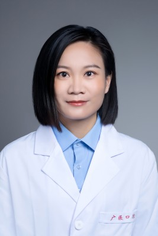

<!-- AUTO-GENERATED-BY: work/generate_obsidian_profiles.py -->

<!-- TEMPLATE: D:\workspace\信息收集整理\医生画像仓库\模板\医生画像模板.md -->

# 麦熙

## 基础信息

| 字段 | 内容 |
|---|---|
| 姓名 | 麦熙 |
| 医院 | 广州医科大学附属口腔医院 |
| 科室 | 荔湾院区颞下颌关节科、越秀院区颞下颌关节科 |
| 职称/身份 | 副主任医师 |
| 来源链接 | [官网原文](https://www.gykqyy.com/list.html?category=55&id=140) |
| 采集日期 | 2026-08-13 |

## 简介/擅长

运用中医的方法治疗口腔粘膜疾病、口腔颌面疼痛疾病、口腔头面部疑难杂症(检查结果无异常,但影响日常生活的各种症状性疾病)，包括复发性口腔溃疡、口腔扁平苔藓、灼口综合征、舌炎、唇炎、口腔异味、磨牙症、颞下颌关节紊乱病等中医治疗

## 科研项目与成果

- 主持2项省级课题及1项市级课题，发表核心期刊论文10余篇，拥有2项国家实用新型专利技术。

## 论文与学术产出

- 主持2项省级课题及1项市级课题，发表核心期刊论文10余篇，拥有2项国家实用新型专利技术。

## 可包装亮点

- 广州中医药大学中西医结合临床医学硕士，从事口腔中医工作20余年，现任广东省保健协会口腔保健分会第三届常务委员、广东省肿瘤康复学会中医肿瘤康复分会常委，曾获得“广医口腔好医生”称号。
- 主持2项省级课题及1项市级课题，发表核心期刊论文10余篇，拥有2项国家实用新型专利技术。

## 重点疾病/人群标签

- 慢性病：
- 肿瘤：肿瘤、康复、疼痛、疑难
- 生殖疾病：
- 免疫/风湿：
- 术后恢复/康复：肿瘤、康复、疼痛、疑难
- 疑难重症：肿瘤、康复、疼痛、疑难

## 证据摘录

> 只摘录官网公开信息中的短句或关键字段，不复制大段原文。

- 官网身份字段：副主任医师
- 官网简介/擅长：运用中医的方法治疗口腔粘膜疾病、口腔颌面疼痛疾病、口腔头面部疑难杂症(检查结果无异常,但影响日常生活的各种症状性疾病)，包括复发性口腔溃疡、口腔扁平苔藓、灼口综合征、舌炎、唇炎、口腔异味、磨牙症、颞下颌关节紊乱病等中医治疗
- 官网亮眼经历线索：广州中医药大学中西医结合临床医学硕士，从事口腔中医工作20余年，现任广东省保健协会口腔保健分会第三届常务委员、广东省肿瘤康复学会中医肿瘤康复分会常委，曾获得“广医口腔好医生”称号。 主持2项省级课题及1项市级课题，发表核心期刊论文10余篇，拥有2项国家实用新型专利技术。
- 来源链接：https://www.gykqyy.com/list.html?category=55&id=140

## BD 画像摘要

麦熙医生可作为肿瘤、术后恢复/康复、疑难重症方向的基础画像候选。后续 BD 使用应继续以官网来源和人工复核为准，不添加疗效承诺或无来源包装。

## 合规边界

- 仅使用医院官网、官方公众号、官方小程序等公开渠道。
- 不采集私人电话、私人微信、家庭住址、患者隐私或非公开排班信息。
- 不写“保证治愈”“疗效第一”“包治疑难杂症”等无法由官网证明的表述。
