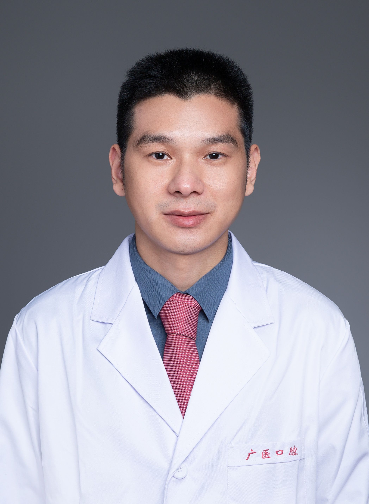

<!-- AUTO-GENERATED-BY: work/generate_obsidian_profiles.py -->

<!-- TEMPLATE: D:\workspace\信息收集整理\医生画像仓库\模板\医生画像模板.md -->

# 黄江勇

## 基础信息

| 字段 | 内容 |
|---|---|
| 姓名 | 黄江勇 |
| 医院 | 广州医科大学附属口腔医院 |
| 科室 | 越秀院区口腔修复科、专家门诊特诊中心 |
| 职称/身份 | 副主任医师 |
| 来源链接 | [官网原文](https://www.gykqyy.com/list.html?category=55&id=198) |
| 采集日期 | 2026-08-13 |

## 简介/擅长

各类缺牙的种植修复、各类固定及活动修复、美学修复、数字化修复、咬合相关疾病的修复治疗等

## 科研项目与成果

- 广东省口腔医学会口腔修复专委会青年委员，广东省精准医学会咬合与题下颌疾病分会常务委员，广东省医学美容学会口腔分会委员，主持及参与多项省市级课题，发表各类论文10余篇，参与编写相关专著4本。

## 论文与学术产出

- 广东省口腔医学会口腔修复专委会青年委员，广东省精准医学会咬合与题下颌疾病分会常务委员，广东省医学美容学会口腔分会委员，主持及参与多项省市级课题，发表各类论文10余篇，参与编写相关专著4本。

## 可包装亮点

- 副主任医师，硕士研究生导师，越秀院区修复科副主任，修复工艺室负责人；
- 广东省口腔医学会口腔修复专委会青年委员，广东省精准医学会咬合与题下颌疾病分会常务委员，广东省医学美容学会口腔分会委员，主持及参与多项省市级课题，发表各类论文10余篇，参与编写相关专著4本。

## 重点疾病/人群标签

- 慢性病：
- 肿瘤：
- 生殖疾病：
- 免疫/风湿：
- 术后恢复/康复：
- 疑难重症：

## 证据摘录

> 只摘录官网公开信息中的短句或关键字段，不复制大段原文。

- 官网身份字段：副主任医师
- 官网简介/擅长：各类缺牙的种植修复、各类固定及活动修复、美学修复、数字化修复、咬合相关疾病的修复治疗等
- 官网亮眼经历线索：副主任医师，硕士研究生导师，越秀院区修复科副主任，修复工艺室负责人； 广东省口腔医学会口腔修复专委会青年委员，广东省精准医学会咬合与题下颌疾病分会常务委员，广东省医学美容学会口腔分会委员，主持及参与多项省市级课题，发表各类论文10余篇，参与编写相关专著4本。
- 来源链接：https://www.gykqyy.com/list.html?category=55&id=198

## BD 画像摘要

黄江勇医生可作为广州医科大学附属口腔医院越秀院区口腔修复科、专家门诊特诊中心的基础医生资料入库。当前重点方向以总底表标签为准，官网未展示的信息保持空白。

## 合规边界

- 仅使用医院官网、官方公众号、官方小程序等公开渠道。
- 不采集私人电话、私人微信、家庭住址、患者隐私或非公开排班信息。
- 不写“保证治愈”“疗效第一”“包治疑难杂症”等无法由官网证明的表述。
