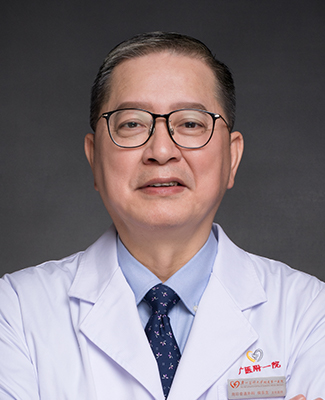

<!-- AUTO-GENERATED-BY: work/generate_obsidian_profiles.py -->

<!-- TEMPLATE: D:\workspace\信息收集整理\医生画像仓库\模板\医生画像模板.md -->

# 侯东生

## 基础信息

| 字段 | 内容 |
|---|---|
| 姓名 | 侯东生 |
| 医院 | 广州医科大学附属第一医院 |
| 科室 | 肝胆外科 |
| 职称/身份 | 主任医师 |
| 来源链接 | [官网原文](https://www.gyfyyy.cn/cn/ks/wk/gdwk/doctor_556.html) |
| 采集日期 | 2026-08-13 |

## 简介/擅长

肝胆、胃肠、胰腺、脾、疝气、甲状腺、乳腺等普外疾病的诊断和外科治疗（擅长微创腹腔镜外科手术）。

## 可包装亮点

- 肝胆、胃肠、胰腺、脾、疝气、甲状腺、乳腺等普外疾病的诊断和外科治疗（擅长微创腹腔镜外科手术）。

## 重点疾病/人群标签

- 慢性病：
- 肿瘤：
- 生殖疾病：
- 免疫/风湿：
- 术后恢复/康复：
- 疑难重症：

## 证据摘录

> 只摘录官网公开信息中的短句或关键字段，不复制大段原文。

- 官网身份字段：主任医师
- 官网简介/擅长：肝胆、胃肠、胰腺、脾、疝气、甲状腺、乳腺等普外疾病的诊断和外科治疗（擅长微创腹腔镜外科手术）。
- 来源链接：https://www.gyfyyy.cn/cn/ks/wk/gdwk/doctor_556.html

## BD 画像摘要

侯东生医生可作为广州医科大学附属第一医院肝胆外科的基础医生资料入库。当前重点方向以总底表标签为准，官网未展示的信息保持空白。

## 合规边界

- 仅使用医院官网、官方公众号、官方小程序等公开渠道。
- 不采集私人电话、私人微信、家庭住址、患者隐私或非公开排班信息。
- 不写“保证治愈”“疗效第一”“包治疑难杂症”等无法由官网证明的表述。
