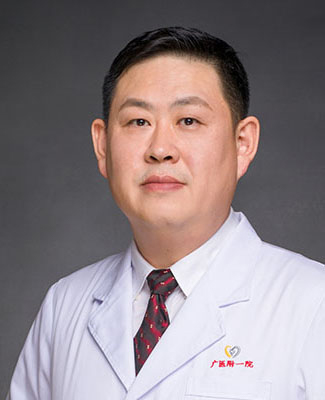

<!-- AUTO-GENERATED-BY: work/generate_obsidian_profiles.py -->

<!-- TEMPLATE: D:\workspace\信息收集整理\医生画像仓库\模板\医生画像模板.md -->

# 冀航

## 基础信息

| 字段 | 内容 |
|---|---|
| 姓名 | 冀航 |
| 医院 | 广州医科大学附属第一医院 |
| 科室 | 整形外科 |
| 职称/身份 | 副主任医师 |
| 来源链接 | [官网原文](https://www.gyfyyy.cn/cn/ks/wk/zxwk/doctor_172.html) |
| 采集日期 | 2026-08-13 |

## 简介/擅长

眼、鼻整形美容；乳房整形；吸脂及自体脂肪填充面部年轻化；肉毒素及玻尿酸等微整形；面部、躯干及四肢畸形及体表肿瘤的根治及美容修复。

## 可包装亮点

- 担任中华医学会整形外科分会数字医学学组委员、中国医师协会美容与整形医师分会会员、中国医师协会美容毛发医学分会委员、中国整形美容协会损伤救治委员会常务理事、中国整形美容协会眼整形分会委员等职务。

## 重点疾病/人群标签

- 慢性病：
- 肿瘤：肿瘤
- 生殖疾病：
- 免疫/风湿：
- 术后恢复/康复：
- 疑难重症：

## 证据摘录

> 只摘录官网公开信息中的短句或关键字段，不复制大段原文。

- 官网身份字段：副主任医师
- 官网简介/擅长：眼、鼻整形美容；乳房整形；吸脂及自体脂肪填充面部年轻化；肉毒素及玻尿酸等微整形；面部、躯干及四肢畸形及体表肿瘤的根治及美容修复。
- 官网亮眼经历线索：担任中华医学会整形外科分会数字医学学组委员、中国医师协会美容与整形医师分会会员、中国医师协会美容毛发医学分会委员、中国整形美容协会损伤救治委员会常务理事、中国整形美容协会眼整形分会委员等职务。
- 来源链接：https://www.gyfyyy.cn/cn/ks/wk/zxwk/doctor_172.html

## BD 画像摘要

冀航医生可作为肿瘤方向的基础画像候选。后续 BD 使用应继续以官网来源和人工复核为准，不添加疗效承诺或无来源包装。

## 合规边界

- 仅使用医院官网、官方公众号、官方小程序等公开渠道。
- 不采集私人电话、私人微信、家庭住址、患者隐私或非公开排班信息。
- 不写“保证治愈”“疗效第一”“包治疑难杂症”等无法由官网证明的表述。
