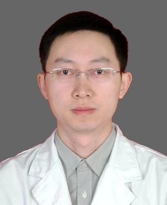

<!-- AUTO-GENERATED-BY: work/generate_obsidian_profiles.py -->

<!-- TEMPLATE: D:\workspace\信息收集整理\医生画像仓库\模板\医生画像模板.md -->

# 刘云奇

## 基础信息

| 字段 | 内容 |
|---|---|
| 姓名 | 刘云奇 |
| 医院 | 广州医科大学附属第一医院 |
| 科室 | 心脏外科 |
| 职称/身份 | 心脏外科副主任，副主任医师 |
| 来源链接 | [官网原文](https://www.gyfyyy.cn/cn/ks/wk/xzwk/doctor_748.html) |
| 采集日期 | 2026-08-13 |

## 简介/擅长

从事心脏大血管外科10余年，积累了丰富的临床经验，擅长冠心病、心脏瓣膜病、先天性心脏病的微创手术治疗。作为全球首例无缺血心脏移植手术团队的主要成员，在心脏移植、人工心脏等心脏机械辅助方面也独到的专长。

## 科研项目与成果

- 获国家发明专利8项，发表SCI论文10篇，主持省部级基金2项，参编八年制外科学辅助教材1部，人卫版心脏外科参考书3部。

## 论文与学术产出

- 获国家发明专利8项，发表SCI论文10篇，主持省部级基金2项，参编八年制外科学辅助教材1部，人卫版心脏外科参考书3部。

## 可包装亮点

- 担任广东省医学会心血管外科分会青年委员，广东省医师协会心血管外科分会委员，广东省胸部疾病学会心血管外科专业委员会秘书，广东省呼吸与健康学会常务委员，广东省胸部疾病学会心肺移植专业委员会委员，广东省生物医学工程学会委员，广州市医学会器官移植分会委员。
- 获国家发明专利8项，发表SCI论文10篇，主持省部级基金2项，参编八年制外科学辅助教材1部，人卫版心脏外科参考书3部。

## 重点疾病/人群标签

- 慢性病：冠心病
- 肿瘤：
- 生殖疾病：
- 免疫/风湿：
- 术后恢复/康复：
- 疑难重症：

## 证据摘录

> 只摘录官网公开信息中的短句或关键字段，不复制大段原文。

- 官网身份字段：心脏外科副主任，副主任医师
- 官网简介/擅长：从事心脏大血管外科10余年，积累了丰富的临床经验，擅长冠心病、心脏瓣膜病、先天性心脏病的微创手术治疗。作为全球首例无缺血心脏移植手术团队的主要成员，在心脏移植、人工心脏等心脏机械辅助方面也独到的专长。
- 官网亮眼经历线索：担任广东省医学会心血管外科分会青年委员，广东省医师协会心血管外科分会委员，广东省胸部疾病学会心血管外科专业委员会秘书，广东省呼吸与健康学会常务委员，广东省胸部疾病学会心肺移植专业委员会委员，广东省生物医学工程学会委员，广州市医学会器官移植分会委员。 获国家发明专利8项，发表SCI论文10篇，主持省部级基金2项，参编八年制外科学辅助教材1部，人卫版心脏外科参考书3部。
- 来源链接：https://www.gyfyyy.cn/cn/ks/wk/xzwk/doctor_748.html

## BD 画像摘要

刘云奇医生可作为慢性病方向的基础画像候选。后续 BD 使用应继续以官网来源和人工复核为准，不添加疗效承诺或无来源包装。

## 合规边界

- 仅使用医院官网、官方公众号、官方小程序等公开渠道。
- 不采集私人电话、私人微信、家庭住址、患者隐私或非公开排班信息。
- 不写“保证治愈”“疗效第一”“包治疑难杂症”等无法由官网证明的表述。
