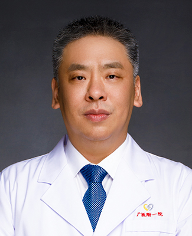

<!-- AUTO-GENERATED-BY: work/generate_obsidian_profiles.py -->

<!-- TEMPLATE: D:\workspace\信息收集整理\医生画像仓库\模板\医生画像模板.md -->

# 刘君

## 基础信息

| 字段 | 内容 |
|---|---|
| 姓名 | 刘君 |
| 医院 | 广州医科大学附属第一医院 |
| 科室 | 胸外科 |
| 职称/身份 | 肿瘤外科副主任，胸外科病区主任，教授 主任医师 |
| 来源链接 | [官网原文](https://www.gyfyyy.cn/cn/ks/wk/xwk/doctor_103.html) |
| 采集日期 | 2026-08-13 |

## 简介/擅长

常见胸外科疾病的诊治，擅长纯腔镜肺叶切除丶肺癌袖状切除等腔镜手术，完成多例气管肿瘤、巨大胸腔内肿瘤等高难度手术，掌握自主呼吸状态下胸腔镜手术等前沿技术。

## 教育与进修经历

- 研究生毕业，医学博士学位，胸外科主任医师、教授，博士生导师，医院党委委员。
- 1997年7月加入中国共产党，毕业于广州医科大学，专业方向微创胸外科及胸部肿瘤微创治疗。

## 可包装亮点

- 研究生毕业，医学博士学位，胸外科主任医师、教授，博士生导师，医院党委委员。
- 担任：中华医学会胸心血管外科分会青年委员、中国抗癌协会腔镜与机器人分会常务委员、中国医疗保健国际交流促进会常务委员暨青年委员会副主任委员、广东省医学会胸外科学分会委员暨青年委员会副主任委员、广东胸部疾病学会肺癌多学科治疗分会主任委员、广东省微创外科学会胸外科学组副组长。

## 重点疾病/人群标签

- 慢性病：
- 肿瘤：肿瘤、癌、肺癌、多学科
- 生殖疾病：
- 免疫/风湿：
- 术后恢复/康复：
- 疑难重症：肿瘤、癌、肺癌、多学科

## 证据摘录

> 只摘录官网公开信息中的短句或关键字段，不复制大段原文。

- 官网身份字段：肿瘤外科副主任，胸外科病区主任，教授 主任医师
- 官网简介/擅长：常见胸外科疾病的诊治，擅长纯腔镜肺叶切除丶肺癌袖状切除等腔镜手术，完成多例气管肿瘤、巨大胸腔内肿瘤等高难度手术，掌握自主呼吸状态下胸腔镜手术等前沿技术。
- 官网亮眼经历线索：研究生毕业，医学博士学位，胸外科主任医师、教授，博士生导师，医院党委委员。 担任：中华医学会胸心血管外科分会青年委员、中国抗癌协会腔镜与机器人分会常务委员、中国医疗保健国际交流促进会常务委员暨青年委员会副主任委员、广东省医学会胸外科学分会委员暨青年委员会副主任委员、广东胸部疾病学会肺癌多学科治疗分会主任委员、广东省微创外科学会胸外科学组副组长。
- 来源链接：https://www.gyfyyy.cn/cn/ks/wk/xwk/doctor_103.html

## BD 画像摘要

刘君医生可作为肿瘤、疑难重症方向的基础画像候选。后续 BD 使用应继续以官网来源和人工复核为准，不添加疗效承诺或无来源包装。

## 合规边界

- 仅使用医院官网、官方公众号、官方小程序等公开渠道。
- 不采集私人电话、私人微信、家庭住址、患者隐私或非公开排班信息。
- 不写“保证治愈”“疗效第一”“包治疑难杂症”等无法由官网证明的表述。
