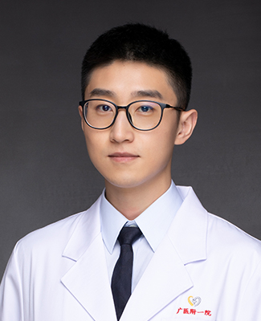

<!-- AUTO-GENERATED-BY: work/generate_obsidian_profiles.py -->

<!-- TEMPLATE: D:\workspace\信息收集整理\医生画像仓库\模板\医生画像模板.md -->

# 刘旸

## 基础信息

| 字段 | 内容 |
|---|---|
| 姓名 | 刘旸 |
| 医院 | 广州医科大学附属第一医院 |
| 科室 | 泌尿外科 |
| 职称/身份 | 医师 |
| 来源链接 | [官网原文](https://www.gyfyyy.cn/cn/ks/wk/bnwk/doctor_573.html) |
| 采集日期 | 2026-08-13 |

## 简介/擅长

泌尿系结石病因的分子机制研究以及泌尿系结石的预防。

## 科研项目与成果

- 主持国家自然青年基金1项，广州市科技局基金1项，广州市教育局项目1项，参与多项国家自然科学基金项目；

## 论文与学术产出

- 累计发表泌尿系结石相关研究SCI/ESCI论文13篇，其中第一(或并列)作者发表于EBioMedicine，BJU International，World Journal of Urology等杂志9篇；
- 参编英文专著2本。

## 可包装亮点

- 主持国家自然青年基金1项，广州市科技局基金1项，广州市教育局项目1项，参与多项国家自然科学基金项目；
- 累计发表泌尿系结石相关研究SCI/ESCI论文13篇，其中第一(或并列)作者发表于EBioMedicine，BJU International，World Journal of Urology等杂志9篇；
- 曾在美国泌尿外科年会、欧洲泌尿外科结石年会、国际尿石症联盟年会、全国泌尿外科年会上进行发言汇报。

## 重点疾病/人群标签

- 慢性病：
- 肿瘤：
- 生殖疾病：
- 免疫/风湿：
- 术后恢复/康复：
- 疑难重症：

## 证据摘录

> 只摘录官网公开信息中的短句或关键字段，不复制大段原文。

- 官网身份字段：医师
- 官网简介/擅长：泌尿系结石病因的分子机制研究以及泌尿系结石的预防。
- 官网亮眼经历线索：主持国家自然青年基金1项，广州市科技局基金1项，广州市教育局项目1项，参与多项国家自然科学基金项目； 累计发表泌尿系结石相关研究SCI/ESCI论文13篇，其中第一(或并列)作者发表于EBioMedicine，BJU International，World Journal of Urology等杂志9篇； 曾在美国泌尿外科年会、欧洲泌尿外科结石年会、国际尿石症联盟年会、全国泌尿外科年会上进行发言汇报。
- 来源链接：https://www.gyfyyy.cn/cn/ks/wk/bnwk/doctor_573.html

## BD 画像摘要

刘旸医生可作为广州医科大学附属第一医院泌尿外科的基础医生资料入库。当前重点方向以总底表标签为准，官网未展示的信息保持空白。

## 合规边界

- 仅使用医院官网、官方公众号、官方小程序等公开渠道。
- 不采集私人电话、私人微信、家庭住址、患者隐私或非公开排班信息。
- 不写“保证治愈”“疗效第一”“包治疑难杂症”等无法由官网证明的表述。
