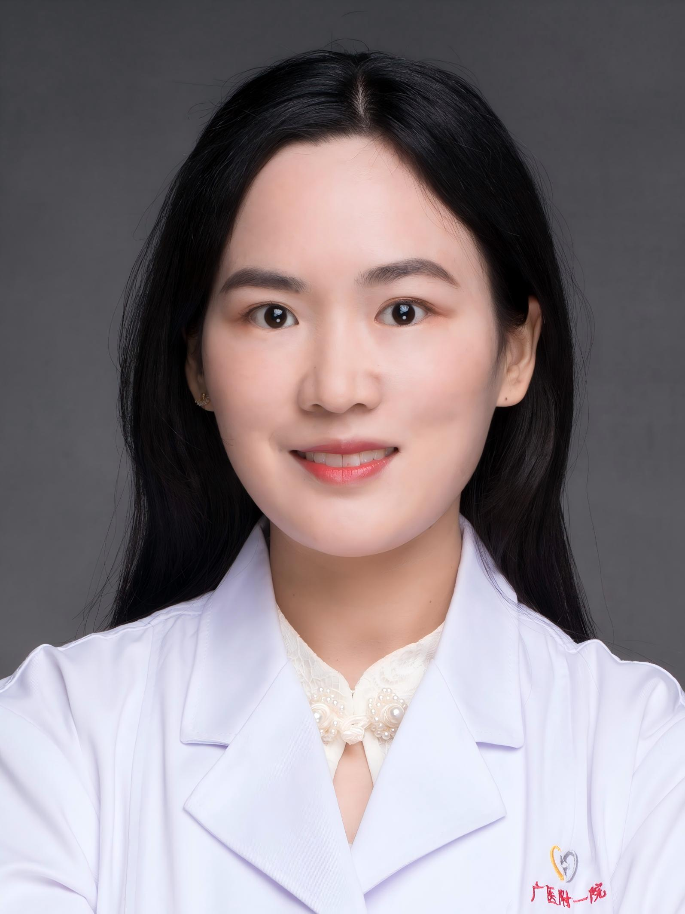

<!-- AUTO-GENERATED-BY: work/generate_obsidian_profiles.py -->

<!-- TEMPLATE: D:\workspace\信息收集整理\医生画像仓库\模板\医生画像模板.md -->

# 刘桑田

## 基础信息

| 字段 | 内容 |
|---|---|
| 姓名 | 刘桑田 |
| 医院 | 广州医科大学附属第一医院 |
| 科室 | 器官移植科 |
| 职称/身份 | 主治医生 |
| 来源链接 | [官网原文](https://www.gyfyyy.cn/cn/ks/wk/qgyz/doctor_914.html) |
| 采集日期 | 2026-08-13 |

## 简介/擅长

胸部疾病筛查与健康体检、肺结节的早期诊断、肺癌的综合治疗与全程管理（包括靶向治疗、免疫治疗、化疗及围术期辅助治疗）；尘肺、慢阻肺、间质性肺病等终末期肺病的肺移植评估。

## 教育与进修经历

- 教育经历：同济大学临床医学本硕博毕业，上海市优秀毕业生获得者。
- 广州医科大学胸外科博士后，何建行教授团队成员。
- 主持国家自然科学青年项目、博士后面上项目。

## 科研项目与成果

- 主持国家自然科学青年项目、博士后面上项目。

## 可包装亮点

- 胸部疾病筛查与健康体检、肺结节的早期诊断、肺癌的综合治疗与全程管理（包括靶向治疗、免疫治疗、化疗及围术期辅助治疗）；
- 尘肺、慢阻肺、间质性肺病等终末期肺病的肺移植评估。

## 重点疾病/人群标签

- 慢性病：
- 肿瘤：
- 生殖疾病：
- 免疫/风湿：
- 术后恢复/康复：
- 疑难重症：

## 证据摘录

> 只摘录官网公开信息中的短句或关键字段，不复制大段原文。

- 官网身份字段：主治医生
- 官网简介/擅长：胸部疾病筛查与健康体检、肺结节的早期诊断、肺癌的综合治疗与全程管理（包括靶向治疗、免疫治疗、化疗及围术期辅助治疗）；尘肺、慢阻肺、间质性肺病等终末期肺病的肺移植评估。
- 异常提示：职称/身份需人工复核
- 来源链接：https://www.gyfyyy.cn/cn/ks/wk/qgyz/doctor_914.html

## BD 画像摘要

刘桑田医生可作为广州医科大学附属第一医院器官移植科的基础医生资料入库。当前重点方向以总底表标签为准，官网未展示的信息保持空白。

## 合规边界

- 仅使用医院官网、官方公众号、官方小程序等公开渠道。
- 不采集私人电话、私人微信、家庭住址、患者隐私或非公开排班信息。
- 不写“保证治愈”“疗效第一”“包治疑难杂症”等无法由官网证明的表述。
