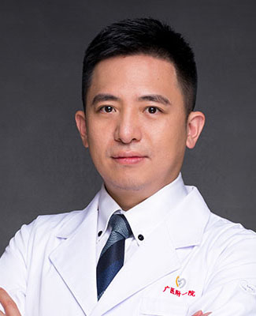

<!-- AUTO-GENERATED-BY: work/generate_obsidian_profiles.py -->

<!-- TEMPLATE: D:\workspace\信息收集整理\医生画像仓库\模板\医生画像模板.md -->

# 古迪

## 基础信息

| 字段 | 内容 |
|---|---|
| 姓名 | 古迪 |
| 医院 | 广州医科大学附属第一医院 |
| 科室 | 泌尿外科 |
| 职称/身份 | 泌尿外科副主任，主任医师 博士后导师 |
| 来源链接 | [官网原文](https://www.gyfyyy.cn/cn/ks/wk/bnwk/doctor_120.html) |
| 采集日期 | 2026-08-13 |

## 简介/擅长

泌尿系肿瘤及尿控的诊疗，擅长前列腺癌，膀胱癌、肾癌和前列腺增生症的诊断和微创治疗，是达芬奇机器人手术专职医生。

## 教育与进修经历

- 2013年经全国选拔成为首位参加中华医学会-英国皇家医学会泌尿外科专科培训项目的医生，2016年取得在英行医执照。

## 科研项目与成果

- 2013年经全国选拔成为首位参加中华医学会-英国皇家医学会泌尿外科专科培训项目的医生，2016年取得在英行医执照。

## 可包装亮点

- 2013年经全国选拔成为首位参加中华医学会-英国皇家医学会泌尿外科专科培训项目的医生，2016年取得在英行医执照。
- 曾任英国伦敦国王医院高级主治医生，伦敦大学学院医院机器人手术专职医生。
- 兼任欧洲泌尿外科学会青年委员，国际泌尿外科学会会员，中华医学会泌尿外科学分会机器人学组全国委员，中华医学会泌尿外科学分会全国青年委员，中国医师协会泌尿外科学分会全国青年委员，中国医师协会男科与性医学会青委副主任委员等。
- 担任Frontier Oncology编委及审稿人，中华腔镜泌尿外科杂志编委，英国国际泌尿外科杂志中文版编委，机器人外科学杂志通讯编委和UpToDate 临床顾问中文翻译专家。

## 重点疾病/人群标签

- 慢性病：
- 肿瘤：肿瘤、癌
- 生殖疾病：
- 免疫/风湿：
- 术后恢复/康复：
- 疑难重症：

## 证据摘录

> 只摘录官网公开信息中的短句或关键字段，不复制大段原文。

- 官网身份字段：泌尿外科副主任，主任医师 博士后导师
- 官网简介/擅长：泌尿系肿瘤及尿控的诊疗，擅长前列腺癌，膀胱癌、肾癌和前列腺增生症的诊断和微创治疗，是达芬奇机器人手术专职医生。
- 官网亮眼经历线索：2013年经全国选拔成为首位参加中华医学会-英国皇家医学会泌尿外科专科培训项目的医生，2016年取得在英行医执照。 曾任英国伦敦国王医院高级主治医生，伦敦大学学院医院机器人手术专职医生。 兼任欧洲泌尿外科学会青年委员，国际泌尿外科学会会员，中华医学会泌尿外科学分会机器人学组全国委员，中华医学会泌尿外科学分会全国青年委员，中国医师协会泌尿外科学分会全国青年委员，中国医师协会男科与性医学会青委副主任委员等。 担任Frontier Onco…
- 来源链接：https://www.gyfyyy.cn/cn/ks/wk/bnwk/doctor_120.html

## BD 画像摘要

古迪医生可作为肿瘤方向的基础画像候选。后续 BD 使用应继续以官网来源和人工复核为准，不添加疗效承诺或无来源包装。

## 合规边界

- 仅使用医院官网、官方公众号、官方小程序等公开渠道。
- 不采集私人电话、私人微信、家庭住址、患者隐私或非公开排班信息。
- 不写“保证治愈”“疗效第一”“包治疑难杂症”等无法由官网证明的表述。
