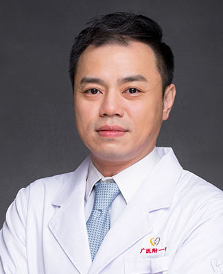

<!-- AUTO-GENERATED-BY: work/generate_obsidian_profiles.py -->

<!-- TEMPLATE: D:\workspace\信息收集整理\医生画像仓库\模板\医生画像模板.md -->

# 叶熹罡

## 基础信息

| 字段 | 内容 |
|---|---|
| 姓名 | 叶熹罡 |
| 医院 | 广州医科大学附属第一医院 |
| 科室 | 乳腺外科 |
| 职称/身份 | 副主任医师 |
| 来源链接 | [官网原文](https://www.gyfyyy.cn/cn/ks/wk/rxwk/doctor_417.html) |
| 采集日期 | 2026-08-13 |

## 简介/擅长

长期从事乳腺良恶性疾病的诊断及外科治疗，乳腺疾病的各类手术治疗(乳腺良性肿瘤的美容切除和微创手术、乳管镜诊断技术、早期乳腺癌的保乳及改良手术、乳腺癌术后乳房重建手术等等)，对乳腺癌术后化疗、内分泌治疗等综合治疗均有研究。

## 可包装亮点

- 长期从事乳腺良恶性疾病的诊断及外科治疗，乳腺疾病的各类手术治疗(乳腺良性肿瘤的美容切除和微创手术、乳管镜诊断技术、早期乳腺癌的保乳及改良手术、乳腺癌术后乳房重建手术等等)，对乳腺癌术后化疗、内分泌治疗等综合治疗均有研究。

## 重点疾病/人群标签

- 慢性病：
- 肿瘤：肿瘤、化疗、乳腺癌、术后
- 生殖疾病：
- 免疫/风湿：
- 术后恢复/康复：肿瘤、化疗、乳腺癌、术后
- 疑难重症：

## 证据摘录

> 只摘录官网公开信息中的短句或关键字段，不复制大段原文。

- 官网身份字段：副主任医师
- 官网简介/擅长：长期从事乳腺良恶性疾病的诊断及外科治疗，乳腺疾病的各类手术治疗(乳腺良性肿瘤的美容切除和微创手术、乳管镜诊断技术、早期乳腺癌的保乳及改良手术、乳腺癌术后乳房重建手术等等)，对乳腺癌术后化疗、内分泌治疗等综合治疗均有研究。
- 来源链接：https://www.gyfyyy.cn/cn/ks/wk/rxwk/doctor_417.html

## BD 画像摘要

叶熹罡医生可作为肿瘤、术后恢复/康复方向的基础画像候选。后续 BD 使用应继续以官网来源和人工复核为准，不添加疗效承诺或无来源包装。

## 合规边界

- 仅使用医院官网、官方公众号、官方小程序等公开渠道。
- 不采集私人电话、私人微信、家庭住址、患者隐私或非公开排班信息。
- 不写“保证治愈”“疗效第一”“包治疑难杂症”等无法由官网证明的表述。
