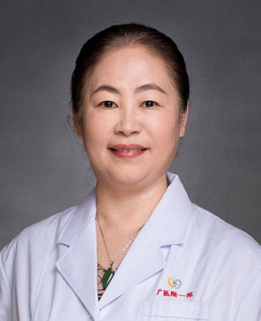

<!-- AUTO-GENERATED-BY: work/generate_obsidian_profiles.py -->

<!-- TEMPLATE: D:\workspace\信息收集整理\医生画像仓库\模板\医生画像模板.md -->

# 叶珊慧

## 基础信息

| 字段 | 内容 |
|---|---|
| 姓名 | 叶珊慧 |
| 医院 | 广州医科大学附属第一医院 |
| 科室 | 风湿科 |
| 职称/身份 | 风湿科主任，主任医师 |
| 来源链接 | [官网原文](https://www.gyfyyy.cn/cn/ks/nk/fsk/doctor_96.html) |
| 采集日期 | 2026-08-13 |

## 简介/擅长

类风湿关节炎、系统性红斑狼疮、强直性脊柱炎、多发性肌炎/皮肌炎、干燥综合症、系统性硬化、各种系统性血管炎、风湿性关节炎、骨关节炎、骨质疏松、痛风及心血管疾病如风湿性心脏病、冠心病、高血压、高脂血等诊治，尤其是长期不规则发热、乏力、关节痛、腰背痛、肌肉酸痛、肢端麻痹无力、四肢湿冷、各种皮疹、口腔溃疡、皮下出血、皮肤青斑、口眼干燥、蛋白尿、血尿和不明原因呼吸困难等各种疑难杂症。

## 可包装亮点

- 类风湿关节炎、系统性红斑狼疮、强直性脊柱炎、多发性肌炎/皮肌炎、干燥综合症、系统性硬化、各种系统性血管炎、风湿性关节炎、骨关节炎、骨质疏松、痛风及心血管疾病如风湿性心脏病、冠心病、高血压、高脂血等诊治，尤其是长期不规则发热、乏力、关节痛、腰背痛、肌肉酸痛、肢端麻痹无力、四肢湿冷、各种皮疹、口腔溃疡、皮下出血、皮肤青斑、口眼干燥、蛋白尿、血尿和不明原因呼吸困…

## 重点疾病/人群标签

- 慢性病：高血压、冠心病、风湿、红斑狼疮、类风湿、强直性脊柱炎、疑难
- 肿瘤：
- 生殖疾病：
- 免疫/风湿：高血压、冠心病、风湿、红斑狼疮、类风湿、强直性脊柱炎、疑难
- 术后恢复/康复：
- 疑难重症：高血压、冠心病、风湿、红斑狼疮、类风湿、强直性脊柱炎、疑难

## 证据摘录

> 只摘录官网公开信息中的短句或关键字段，不复制大段原文。

- 官网身份字段：风湿科主任，主任医师
- 官网简介/擅长：类风湿关节炎、系统性红斑狼疮、强直性脊柱炎、多发性肌炎/皮肌炎、干燥综合症、系统性硬化、各种系统性血管炎、风湿性关节炎、骨关节炎、骨质疏松、痛风及心血管疾病如风湿性心脏病、冠心病、高血压、高脂血等诊治，尤其是长期不规则发热、乏力、关节痛、腰背痛、肌肉酸痛、肢端麻痹无力、四肢湿冷、各种皮疹、口腔溃疡、皮下出血、皮肤青斑、口眼干燥、蛋白尿、血尿和不明原因呼吸困难等各种疑难杂症。
- 来源链接：https://www.gyfyyy.cn/cn/ks/nk/fsk/doctor_96.html

## BD 画像摘要

叶珊慧医生可作为慢性病、免疫/风湿/感染、疑难重症方向的基础画像候选。后续 BD 使用应继续以官网来源和人工复核为准，不添加疗效承诺或无来源包装。

## 合规边界

- 仅使用医院官网、官方公众号、官方小程序等公开渠道。
- 不采集私人电话、私人微信、家庭住址、患者隐私或非公开排班信息。
- 不写“保证治愈”“疗效第一”“包治疑难杂症”等无法由官网证明的表述。
