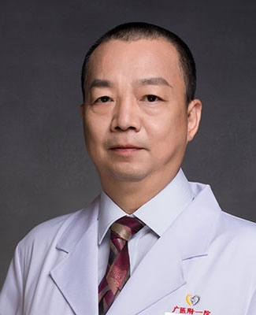

<!-- AUTO-GENERATED-BY: work/generate_obsidian_profiles.py -->

<!-- TEMPLATE: D:\workspace\信息收集整理\医生画像仓库\模板\医生画像模板.md -->

# 吴景明

## 基础信息

| 字段 | 内容 |
|---|---|
| 姓名 | 吴景明 |
| 医院 | 广州医科大学附属第一医院 |
| 科室 | 脊柱外科 |
| 职称/身份 | 主任医师 |
| 来源链接 | [官网原文](https://www.gyfyyy.cn/cn/ks/wk/jzwk/doctor_596.html) |
| 采集日期 | 2026-08-13 |

## 简介/擅长

脊柱疾病（颈肩痛、腰腿痛）的诊治；脊柱骨折、颈椎病、脊柱畸形、椎管狭窄、腰椎滑脱、脊柱肿瘤的开放手术和微创手术；骨关节炎和股骨头坏死的诊治。

## 教育与进修经历

- 1990年在广州医科大学附属第一医院从事骨科临床工作至今，曾在天津医院、新加坡国立大学医院、香港大学玛丽医院进修学习。

## 可包装亮点

- 1990年在广州医科大学附属第一医院从事骨科临床工作至今，曾在天津医院、新加坡国立大学医院、香港大学玛丽医院进修学习。
- 2015年兼任广州医科大学附属第四医院骨科主任。
- 现任广东省中西医结合学会脊柱专业委员会常务委员、广州市医学会脊柱外科学分会副主任委员、广州市医学会骨科学分会常务委员、广东省康复学会颈椎专业委员会常委、广东省医师协会骨科分会委员等等职务，熟悉和接受本专业的最新观点。

## 重点疾病/人群标签

- 慢性病：
- 肿瘤：肿瘤、康复、复杂
- 生殖疾病：
- 免疫/风湿：
- 术后恢复/康复：肿瘤、康复、复杂
- 疑难重症：肿瘤、康复、复杂

## 证据摘录

> 只摘录官网公开信息中的短句或关键字段，不复制大段原文。

- 官网身份字段：主任医师
- 官网简介/擅长：脊柱疾病（颈肩痛、腰腿痛）的诊治；脊柱骨折、颈椎病、脊柱畸形、椎管狭窄、腰椎滑脱、脊柱肿瘤的开放手术和微创手术；骨关节炎和股骨头坏死的诊治。
- 官网亮眼经历线索：1990年在广州医科大学附属第一医院从事骨科临床工作至今，曾在天津医院、新加坡国立大学医院、香港大学玛丽医院进修学习。 2015年兼任广州医科大学附属第四医院骨科主任。 现任广东省中西医结合学会脊柱专业委员会常务委员、广州市医学会脊柱外科学分会副主任委员、广州市医学会骨科学分会常务委员、广东省康复学会颈椎专业委员会常委、广东省医师协会骨科分会委员等等职务，熟悉和接受本专业的最新观点。
- 来源链接：https://www.gyfyyy.cn/cn/ks/wk/jzwk/doctor_596.html

## BD 画像摘要

吴景明医生可作为肿瘤、术后恢复/康复、疑难重症方向的基础画像候选。后续 BD 使用应继续以官网来源和人工复核为准，不添加疗效承诺或无来源包装。

## 合规边界

- 仅使用医院官网、官方公众号、官方小程序等公开渠道。
- 不采集私人电话、私人微信、家庭住址、患者隐私或非公开排班信息。
- 不写“保证治愈”“疗效第一”“包治疑难杂症”等无法由官网证明的表述。
