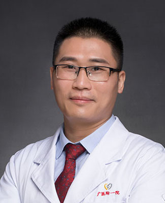

<!-- AUTO-GENERATED-BY: work/generate_obsidian_profiles.py -->

<!-- TEMPLATE: D:\workspace\信息收集整理\医生画像仓库\模板\医生画像模板.md -->

# 唐炜

## 基础信息

| 字段 | 内容 |
|---|---|
| 姓名 | 唐炜 |
| 医院 | 广州医科大学附属第一医院 |
| 科室 | 乳腺外科 |
| 职称/身份 | 乳腺外科主任，副主任医师 |
| 来源链接 | [官网原文](https://www.gyfyyy.cn/cn/ks/wk/rxwk/doctor_169.html) |
| 采集日期 | 2026-08-13 |

## 简介/擅长

乳房腔镜微创、乳房皮瓣整形、乳房修复重建（隆乳、缩乳、再造）等手术以及乳痛症、乳头溢液疾病、副乳症及男性乳房发育等疾病的诊治。

## 教育与进修经历

- 美国爱因斯坦医学院进修深造，致力于乳房疾病精准治疗、综合治疗和美学治疗。
- 乳腺专科负责人，医学博士，副主任医师，硕士研究生导师，博士后合作导师，广州医科大学全英授课教师。
- 国家公派留学美国加州大学旧金山分校（UCSF）和美国叶史瓦大学爱因斯坦医学院。

## 科研项目与成果

- 主持国家自然科学基金。

## 可包装亮点

- 美国爱因斯坦医学院进修深造，致力于乳房疾病精准治疗、综合治疗和美学治疗。
- 乳腺专科负责人，医学博士，副主任医师，硕士研究生导师，博士后合作导师，广州医科大学全英授课教师。
- 主持国家自然科学基金。
- （1）人才称号：首届广东省杰出青年医学人才，广州市高层次青年人才，广州市医学骨干人才，第二届实力中青年医生，羊城青年好医生。

## 重点疾病/人群标签

- 慢性病：
- 肿瘤：
- 生殖疾病：
- 免疫/风湿：
- 术后恢复/康复：
- 疑难重症：

## 证据摘录

> 只摘录官网公开信息中的短句或关键字段，不复制大段原文。

- 官网身份字段：乳腺外科主任，副主任医师
- 官网简介/擅长：乳房腔镜微创、乳房皮瓣整形、乳房修复重建（隆乳、缩乳、再造）等手术以及乳痛症、乳头溢液疾病、副乳症及男性乳房发育等疾病的诊治。
- 官网亮眼经历线索：美国爱因斯坦医学院进修深造，致力于乳房疾病精准治疗、综合治疗和美学治疗。 乳腺专科负责人，医学博士，副主任医师，硕士研究生导师，博士后合作导师，广州医科大学全英授课教师。 主持国家自然科学基金。 （1）人才称号：首届广东省杰出青年医学人才，广州市高层次青年人才，广州市医学骨干人才，第二届实力中青年医生，羊城青年好医生。
- 来源链接：https://www.gyfyyy.cn/cn/ks/wk/rxwk/doctor_169.html

## BD 画像摘要

唐炜医生可作为广州医科大学附属第一医院乳腺外科的基础医生资料入库。当前重点方向以总底表标签为准，官网未展示的信息保持空白。

## 合规边界

- 仅使用医院官网、官方公众号、官方小程序等公开渠道。
- 不采集私人电话、私人微信、家庭住址、患者隐私或非公开排班信息。
- 不写“保证治愈”“疗效第一”“包治疑难杂症”等无法由官网证明的表述。
