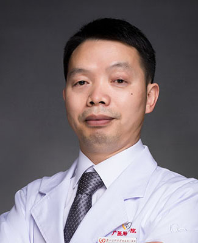

<!-- AUTO-GENERATED-BY: work/generate_obsidian_profiles.py -->

<!-- TEMPLATE: D:\workspace\信息收集整理\医生画像仓库\模板\医生画像模板.md -->

# 喻清和

## 基础信息

| 字段 | 内容 |
|---|---|
| 姓名 | 喻清和 |
| 医院 | 广州医科大学附属第一医院 |
| 科室 | 中医科 |
| 职称/身份 | 中医科副主任，主任医师 |
| 来源链接 | [官网原文](https://www.gyfyyy.cn/cn/ks/zyk/zyk/doctor_235.html) |
| 采集日期 | 2026-08-13 |

## 简介/擅长

中西医结合诊治顽咳、哮喘、慢性咳嗽、支气管扩张症、慢性阻塞性肺疾病，肺部肿瘤等呼吸疑难疾病。

## 教育与进修经历

- 1996年毕业于广州中医药大学，担任广州医科大学附属第一医院中医科副主任，国家第四批名老中医药专家学术经验继承人，喻清和广州市名中医传承工作室建设项目名中医专家；

## 科研项目与成果

- 1996年毕业于广州中医药大学，担任广州医科大学附属第一医院中医科副主任，国家第四批名老中医药专家学术经验继承人，喻清和广州市名中医传承工作室建设项目名中医专家；
- 主持或参与广东省科技项目，获得广东省科学技术进步奖三等奖一项（排名第六）。

## 论文与学术产出

- 主编著作《哮喘中医辨治及验方》、《老年病食疗与宜忌手册》羊城晚报出版社出版；
- 副主编《中医基础与临床》在中山大学出版社出版。

## 可包装亮点

- 1996年毕业于广州中医药大学，担任广州医科大学附属第一医院中医科副主任，国家第四批名老中医药专家学术经验继承人，喻清和广州市名中医传承工作室建设项目名中医专家；
- 任中国民族医药学会呼吸分会常务理事，广东省基层卫生协会中医药专业委员会主任委员，中国医药教育协会中医药教育促进工作委员会常务委员、广东省中医药学会呼吸专业委员会常务委员，广东省中西医结合学会热病（感染病）专业委员会常务委员。
- 主持或参与广东省科技项目，获得广东省科学技术进步奖三等奖一项（排名第六）。
- 2020年获得第六届“羊城好医生”称号。

## 重点疾病/人群标签

- 慢性病：慢性、肿瘤、感染、疑难
- 肿瘤：慢性、肿瘤、感染、疑难
- 生殖疾病：
- 免疫/风湿：慢性、肿瘤、感染、疑难
- 术后恢复/康复：
- 疑难重症：慢性、肿瘤、感染、疑难

## 证据摘录

> 只摘录官网公开信息中的短句或关键字段，不复制大段原文。

- 官网身份字段：中医科副主任，主任医师
- 官网简介/擅长：中西医结合诊治顽咳、哮喘、慢性咳嗽、支气管扩张症、慢性阻塞性肺疾病，肺部肿瘤等呼吸疑难疾病。
- 官网亮眼经历线索：1996年毕业于广州中医药大学，担任广州医科大学附属第一医院中医科副主任，国家第四批名老中医药专家学术经验继承人，喻清和广州市名中医传承工作室建设项目名中医专家； 任中国民族医药学会呼吸分会常务理事，广东省基层卫生协会中医药专业委员会主任委员，中国医药教育协会中医药教育促进工作委员会常务委员、广东省中医药学会呼吸专业委员会常务委员，广东省中西医结合学会热病（感染病）专业委员会常务委员。 主持或参与广东省科技项目，获得广东省科学技术进步…
- 来源链接：https://www.gyfyyy.cn/cn/ks/zyk/zyk/doctor_235.html

## BD 画像摘要

喻清和医生可作为慢性病、肿瘤、免疫/风湿/感染、疑难重症方向的基础画像候选。后续 BD 使用应继续以官网来源和人工复核为准，不添加疗效承诺或无来源包装。

## 合规边界

- 仅使用医院官网、官方公众号、官方小程序等公开渠道。
- 不采集私人电话、私人微信、家庭住址、患者隐私或非公开排班信息。
- 不写“保证治愈”“疗效第一”“包治疑难杂症”等无法由官网证明的表述。
