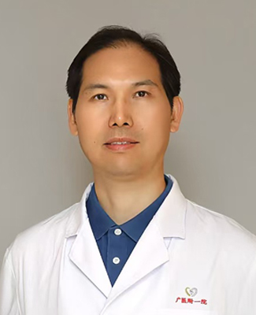

<!-- AUTO-GENERATED-BY: work/generate_obsidian_profiles.py -->

<!-- TEMPLATE: D:\workspace\信息收集整理\医生画像仓库\模板\医生画像模板.md -->

# 夏成雨

## 基础信息

| 字段 | 内容 |
|---|---|
| 姓名 | 夏成雨 |
| 医院 | 广州医科大学附属第一医院 |
| 科室 | 神经外科 |
| 职称/身份 | 主任医师，神经外科学科带头人，科室主任 |
| 来源链接 | [官网原文](https://www.gyfyyy.cn/cn/ks/wk/sjwk/doctor_758.html) |
| 采集日期 | 2026-08-13 |

## 简介/擅长

1、脑膜瘤、垂体瘤、三叉神经鞘瘤、胆脂瘤（表皮样囊肿）、听神经瘤、胶质瘤等各种颅脑及椎管肿瘤的微侵袭显微外科手术，尤其是疑难复杂颅脑手术，包括各部位颅底脑干及脑深部病变手术，如颈静脉孔区肿瘤、鞍区（鞍结节脑膜瘤、脊索瘤）、岩斜坡脑膜瘤、松果体区肿瘤、枕骨大孔区肿瘤、海绵窦区肿瘤、脑干血管母细胞瘤等 其中侵犯矢状窦、横窦等大静脉窦的脑膜瘤全切除技术；颈静脉孔区肿瘤（如神经鞘瘤、球瘤）手术处于国内外顶尖水平。【央视CCTV4健康中国栏目于2026年1月18日专题拍摄报道矢状窦旁脑膜瘤全切除技术】。 2、脑缺血性疾病外科手术：烟雾病直接+间接联合搭桥；颈动脉斑块狭窄内膜剥脱术。 成功手术来自浙江、江苏、上海、重庆、天津、内蒙古、黑龙江、云南、山东、山西、江西、湖北、河北、重庆、广西、安徽等26个省或直辖市疑难复杂颅脑肿瘤。

## 教育与进修经历

- 主任医师，神经外科学科带头人，科室主任，临床医学博士（复旦大学华山医院硕博连读毕业），硕导、博士后导师 擅长： 1、脑膜瘤、垂体瘤、三叉神经鞘瘤、胆脂瘤（表皮样囊肿）、听神经瘤、胶质瘤等各种颅脑及椎管肿瘤的微侵袭显微外科手术，尤其是疑难复杂颅脑手术，包括各部位颅底脑干及脑深部病变手术，如颈静脉孔区肿瘤、鞍区（鞍结节脑膜瘤、脊索瘤）、岩斜坡脑膜瘤、松果体区肿瘤、枕骨大孔区肿瘤、海绵窦区肿瘤、脑干血管母细胞瘤等 其中侵犯矢状窦、横窦等大静脉窦的脑膜瘤全切除技术；
- 获评第十届“羊城好医生”、安徽省首届卫生健康杰出人才，安徽省第八届“省直十大杰出青年”，美国梅奥医院、凤凰城巴洛神经外科研究所(Barrow Neurological Institute)、德国鲁尔大学、Greifswald大学访问学者，连续9年获评好大夫在线“年度好大夫（神经外科）”（2017-2025）。

## 科研项目与成果

- 获评第十届“羊城好医生”、安徽省首届卫生健康杰出人才，安徽省第八届“省直十大杰出青年”，美国梅奥医院、凤凰城巴洛神经外科研究所(Barrow Neurological Institute)、德国鲁尔大学、Greifswald大学访问学者，连续9年获评好大夫在线“年度好大夫（神经外科）”（2017-2025）。

## 可包装亮点

- 主任医师，神经外科学科带头人，科室主任，临床医学博士（复旦大学华山医院硕博连读毕业），硕导、博士后导师 擅长： 1、脑膜瘤、垂体瘤、三叉神经鞘瘤、胆脂瘤（表皮样囊肿）、听神经瘤、胶质瘤等各种颅脑及椎管肿瘤的微侵袭显微外科手术，尤其是疑难复杂颅脑手术，包括各部位颅底脑干及脑深部病变手术，如颈静脉孔区肿瘤、鞍区（鞍结节脑膜瘤、脊索瘤）、岩斜坡脑膜瘤、松果体区肿…
- 成功手术来自浙江、江苏、上海、重庆、天津、内蒙古、黑龙江、云南、山东、山西、江西、湖北、河北、重庆、广西、安徽等26个省或直辖市疑难复杂颅脑肿瘤。
- 简介： 现任中国医师协会神经外科学医师分会第七届全国委员会委员及颅底外科学组委员、中国医促会颅底外科学分会委员、中国垂体腺瘤协作组全国委员、广东省神经外科学分会常委及颅底外科学组委员、广州市神经外科学医师分会副主任委员；
- ...

## 重点疾病/人群标签

- 慢性病：
- 肿瘤：肿瘤、瘤、疑难、复杂
- 生殖疾病：
- 免疫/风湿：
- 术后恢复/康复：
- 疑难重症：肿瘤、瘤、疑难、复杂

## 证据摘录

> 只摘录官网公开信息中的短句或关键字段，不复制大段原文。

- 官网身份字段：主任医师，神经外科学科带头人，科室主任
- 官网简介/擅长：1、脑膜瘤、垂体瘤、三叉神经鞘瘤、胆脂瘤（表皮样囊肿）、听神经瘤、胶质瘤等各种颅脑及椎管肿瘤的微侵袭显微外科手术，尤其是疑难复杂颅脑手术，包括各部位颅底脑干及脑深部病变手术，如颈静脉孔区肿瘤、鞍区（鞍结节脑膜瘤、脊索瘤）、岩斜坡脑膜瘤、松果体区肿瘤、枕骨大孔区肿瘤、海绵窦区肿瘤、脑干血管母细胞瘤等 其中侵犯矢状窦、横窦等大静脉窦的脑膜瘤全切除技术；颈静脉孔区肿瘤（如神经鞘瘤、球瘤）手术处于国内外顶尖水平。【央视CCTV4健康中国栏目于…
- 官网亮眼经历线索：主任医师，神经外科学科带头人，科室主任，临床医学博士（复旦大学华山医院硕博连读毕业），硕导、博士后导师 擅长： 1、脑膜瘤、垂体瘤、三叉神经鞘瘤、胆脂瘤（表皮样囊肿）、听神经瘤、胶质瘤等各种颅脑及椎管肿瘤的微侵袭显微外科手术，尤其是疑难复杂颅脑手术，包括各部位颅底脑干及脑深部病变手术，如颈静脉孔区肿瘤、鞍区（鞍结节脑膜瘤、脊索瘤）、岩斜坡脑膜瘤、松果体区肿瘤、枕骨大孔区肿瘤、海绵窦区肿瘤、脑干血管母细胞瘤等 其中侵犯矢状窦、横窦等大静…
- 来源链接：https://www.gyfyyy.cn/cn/ks/wk/sjwk/doctor_758.html

## BD 画像摘要

夏成雨医生可作为肿瘤、疑难重症方向的基础画像候选。后续 BD 使用应继续以官网来源和人工复核为准，不添加疗效承诺或无来源包装。

## 合规边界

- 仅使用医院官网、官方公众号、官方小程序等公开渠道。
- 不采集私人电话、私人微信、家庭住址、患者隐私或非公开排班信息。
- 不写“保证治愈”“疗效第一”“包治疑难杂症”等无法由官网证明的表述。
