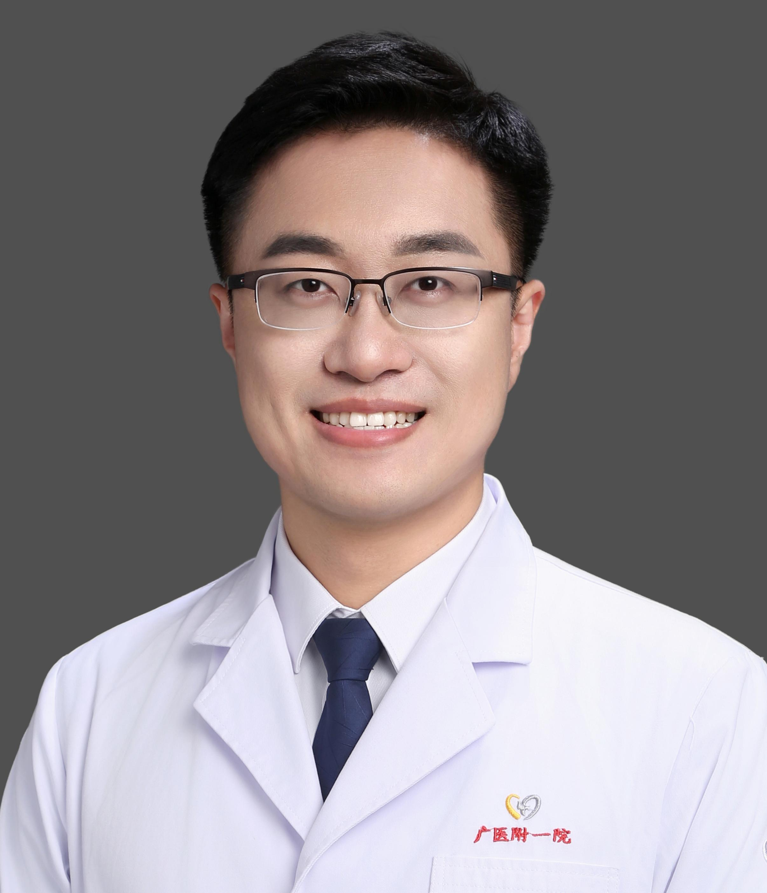

<!-- AUTO-GENERATED-BY: work/generate_obsidian_profiles.py -->

<!-- TEMPLATE: D:\workspace\信息收集整理\医生画像仓库\模板\医生画像模板.md -->

# 左旭政

## 基础信息

| 字段 | 内容 |
|---|---|
| 姓名 | 左旭政 |
| 医院 | 广州医科大学附属第一医院 |
| 科室 | 皮肤科 |
| 职称/身份 | 主治医师 |
| 来源链接 | [官网原文](https://www.gyfyyy.cn/cn/ks/qtzk/pfk/doctor_865.html) |
| 采集日期 | 2026-08-13 |

## 简介/擅长

色素性皮肤病（白癜风、色素斑/色沉等），青春期常见皮肤病（痤疮/青春痘、玫瑰痤疮、毛囊炎等），神经纤维瘤病，激光医学美容等方向。

## 教育与进修经历

- 医学博士，先后于湘雅医学、陆军军医大学、中山大学取得本硕博学位；
- 广东省老年保健协会皮肤再生与抗衰分会常务委员兼青年学组组长，广东省中西医结合学会皮肤性病分会委员，广东省住院医师规范化培训优秀指导医师；

## 科研项目与成果

- 主持/参与多项国家及省级基金，获批国家发明专利2项、实用新型专利3项，国内外学术期刊发表论文10余篇。

## 论文与学术产出

- 主持/参与多项国家及省级基金，获批国家发明专利2项、实用新型专利3项，国内外学术期刊发表论文10余篇。

## 可包装亮点

- 广东省老年保健协会皮肤再生与抗衰分会常务委员兼青年学组组长，广东省中西医结合学会皮肤性病分会委员，广东省住院医师规范化培训优秀指导医师；
- 主持/参与多项国家及省级基金，获批国家发明专利2项、实用新型专利3项，国内外学术期刊发表论文10余篇。

## 重点疾病/人群标签

- 慢性病：
- 肿瘤：瘤
- 生殖疾病：
- 免疫/风湿：
- 术后恢复/康复：
- 疑难重症：

## 证据摘录

> 只摘录官网公开信息中的短句或关键字段，不复制大段原文。

- 官网身份字段：主治医师
- 官网简介/擅长：色素性皮肤病（白癜风、色素斑/色沉等），青春期常见皮肤病（痤疮/青春痘、玫瑰痤疮、毛囊炎等），神经纤维瘤病，激光医学美容等方向。
- 官网亮眼经历线索：广东省老年保健协会皮肤再生与抗衰分会常务委员兼青年学组组长，广东省中西医结合学会皮肤性病分会委员，广东省住院医师规范化培训优秀指导医师； 主持/参与多项国家及省级基金，获批国家发明专利2项、实用新型专利3项，国内外学术期刊发表论文10余篇。
- 来源链接：https://www.gyfyyy.cn/cn/ks/qtzk/pfk/doctor_865.html

## BD 画像摘要

左旭政医生可作为肿瘤方向的基础画像候选。后续 BD 使用应继续以官网来源和人工复核为准，不添加疗效承诺或无来源包装。

## 合规边界

- 仅使用医院官网、官方公众号、官方小程序等公开渠道。
- 不采集私人电话、私人微信、家庭住址、患者隐私或非公开排班信息。
- 不写“保证治愈”“疗效第一”“包治疑难杂症”等无法由官网证明的表述。
