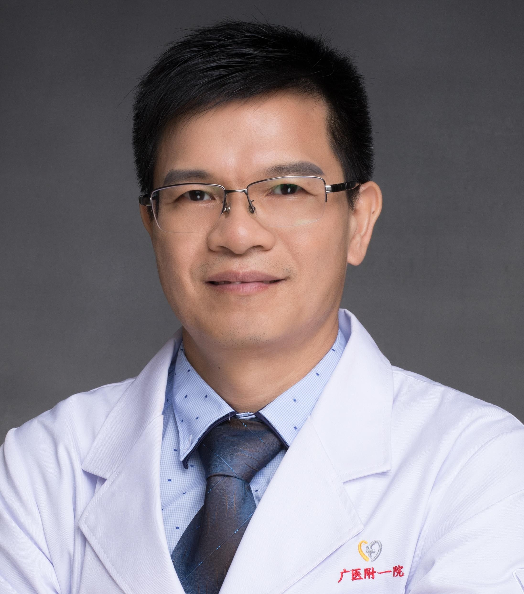

<!-- AUTO-GENERATED-BY: work/generate_obsidian_profiles.py -->

<!-- TEMPLATE: D:\workspace\信息收集整理\医生画像仓库\模板\医生画像模板.md -->

# 廖海星

## 基础信息

| 字段 | 内容 |
|---|---|
| 姓名 | 廖海星 |
| 医院 | 广州医科大学附属第一医院 |
| 科室 | 超声医学科 |
| 职称/身份 | 科室副主任（主持科室工作），主任医师 |
| 来源链接 | [官网原文](https://www.gyfyyy.cn/cn/ks/yj/csyxk/doctor_861.html) |
| 采集日期 | 2026-08-13 |

## 简介/擅长

介入性超声、肿瘤消融治疗

## 教育与进修经历

- 现任科室副主任（主持科室工作）， 具有扎实的 专业知识及丰富的实践经验， 擅长腹部、浅表器官超声诊断，在介入性超声、肿瘤消融治疗与超声造影有较深造诣， 先后到北大肿瘤医院（国内访问学者）、以色列希伯来大学（博士后工作站）做肿瘤消融专项学习研究， 以第一作者 / 通讯作者在 Radiology ， Gastroenterology 等期刊发表论著。

## 论文与学术产出

- 现任科室副主任（主持科室工作）， 具有扎实的 专业知识及丰富的实践经验， 擅长腹部、浅表器官超声诊断，在介入性超声、肿瘤消融治疗与超声造影有较深造诣， 先后到北大肿瘤医院（国内访问学者）、以色列希伯来大学（博士后工作站）做肿瘤消融专项学习研究， 以第一作者 / 通讯作者在 Radiology ， Gastroenterology 等期刊发表论著。

## 可包装亮点

- 现任科室副主任（主持科室工作）， 具有扎实的 专业知识及丰富的实践经验， 擅长腹部、浅表器官超声诊断，在介入性超声、肿瘤消融治疗与超声造影有较深造诣， 先后到北大肿瘤医院（国内访问学者）、以色列希伯来大学（博士后工作站）做肿瘤消融专项学习研究， 以第一作者 / 通讯作者在 Radiology ， Gastroenterology 等期刊发表论著。

## 重点疾病/人群标签

- 慢性病：
- 肿瘤：肿瘤
- 生殖疾病：
- 免疫/风湿：
- 术后恢复/康复：
- 疑难重症：

## 证据摘录

> 只摘录官网公开信息中的短句或关键字段，不复制大段原文。

- 官网身份字段：科室副主任（主持科室工作），主任医师
- 官网简介/擅长：介入性超声、肿瘤消融治疗
- 官网亮眼经历线索：现任科室副主任（主持科室工作）， 具有扎实的 专业知识及丰富的实践经验， 擅长腹部、浅表器官超声诊断，在介入性超声、肿瘤消融治疗与超声造影有较深造诣， 先后到北大肿瘤医院（国内访问学者）、以色列希伯来大学（博士后工作站）做肿瘤消融专项学习研究， 以第一作者 / 通讯作者在 Radiology ， Gastroenterology 等期刊发表论著。
- 来源链接：https://www.gyfyyy.cn/cn/ks/yj/csyxk/doctor_861.html

## BD 画像摘要

廖海星医生可作为肿瘤方向的基础画像候选。后续 BD 使用应继续以官网来源和人工复核为准，不添加疗效承诺或无来源包装。

## 合规边界

- 仅使用医院官网、官方公众号、官方小程序等公开渠道。
- 不采集私人电话、私人微信、家庭住址、患者隐私或非公开排班信息。
- 不写“保证治愈”“疗效第一”“包治疑难杂症”等无法由官网证明的表述。
