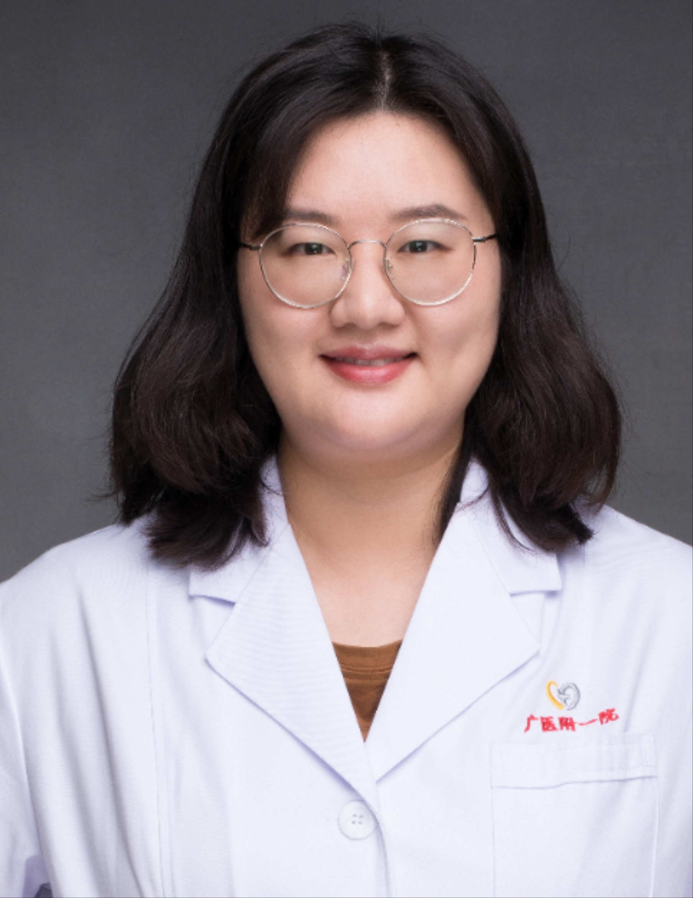

<!-- AUTO-GENERATED-BY: work/generate_obsidian_profiles.py -->

<!-- TEMPLATE: D:\workspace\信息收集整理\医生画像仓库\模板\医生画像模板.md -->

# 廖雯静

## 基础信息

| 字段 | 内容 |
|---|---|
| 姓名 | 廖雯静 |
| 医院 | 广州医科大学附属第一医院 |
| 科室 | 耳鼻咽喉头颈外科 |
| 职称/身份 | 医师 |
| 来源链接 | [官网原文](https://www.gyfyyy.cn/cn/ks/qtzk/ebhk/doctor_885.html) |
| 采集日期 | 2026-08-13 |

## 简介/擅长

各种耳鼻咽喉头部外科常见疾病，如过敏性鼻炎、扁桃体腺样体肥大、睡眠呼吸暂停综合症、甲状腺疾病、鼻咽及喉部恶性肿瘤的诊断和治疗。

## 教育与进修经历

- 广州医科大学博士、博士后，美国Loma Linda University访问学者。
- 参与国自然基金5项，主持国自然、博士后面上等课题3项。

## 科研项目与成果

- 参与国自然基金5项，主持国自然、博士后面上等课题3项。

## 论文与学术产出

- 发表SCI文章20余篇，第一作者7篇。

## 可包装亮点

- 广州医科大学博士、博士后，美国Loma Linda University访问学者。
- 广东省预防医学会耳鼻咽喉头颈疾病防治专业委员会委员及分会秘书，广东省医学会耳鼻咽喉头颈外科睡眠学组秘书，广州市医学会耳鼻咽喉头颈外科学分会委员及秘书。
- 发表SCI文章20余篇，第一作者7篇。

## 重点疾病/人群标签

- 慢性病：
- 肿瘤：肿瘤
- 生殖疾病：
- 免疫/风湿：
- 术后恢复/康复：
- 疑难重症：

## 证据摘录

> 只摘录官网公开信息中的短句或关键字段，不复制大段原文。

- 官网身份字段：医师
- 官网简介/擅长：各种耳鼻咽喉头部外科常见疾病，如过敏性鼻炎、扁桃体腺样体肥大、睡眠呼吸暂停综合症、甲状腺疾病、鼻咽及喉部恶性肿瘤的诊断和治疗。
- 官网亮眼经历线索：广州医科大学博士、博士后，美国Loma Linda University访问学者。 广东省预防医学会耳鼻咽喉头颈疾病防治专业委员会委员及分会秘书，广东省医学会耳鼻咽喉头颈外科睡眠学组秘书，广州市医学会耳鼻咽喉头颈外科学分会委员及秘书。 发表SCI文章20余篇，第一作者7篇。
- 来源链接：https://www.gyfyyy.cn/cn/ks/qtzk/ebhk/doctor_885.html

## BD 画像摘要

廖雯静医生可作为肿瘤方向的基础画像候选。后续 BD 使用应继续以官网来源和人工复核为准，不添加疗效承诺或无来源包装。

## 合规边界

- 仅使用医院官网、官方公众号、官方小程序等公开渠道。
- 不采集私人电话、私人微信、家庭住址、患者隐私或非公开排班信息。
- 不写“保证治愈”“疗效第一”“包治疑难杂症”等无法由官网证明的表述。
