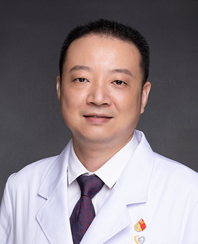

<!-- AUTO-GENERATED-BY: work/generate_obsidian_profiles.py -->

<!-- TEMPLATE: D:\workspace\信息收集整理\医生画像仓库\模板\医生画像模板.md -->

# 张作鹏

## 基础信息

| 字段 | 内容 |
|---|---|
| 姓名 | 张作鹏 |
| 医院 | 广州医科大学附属第一医院 |
| 科室 | 急诊科 |
| 职称/身份 | 广州医科大学临床技能实验中心副主任，副主任医师 |
| 来源链接 | [官网原文](https://www.gyfyyy.cn/cn/ks/jzk/doctor_643.html) |
| 采集日期 | 2026-08-13 |

## 简介/擅长

呼吸系统常见病多发病诊治及急危重症临床救治，包括毒蛇伤与毒蜂救治、呼吸系统危重症、心血管系统急症、脓毒症休克、糖尿病危重症、各种急性中毒救治。

## 教育与进修经历

- 首届、第二届中国医学模拟教学联盟理事，中华医学会灾难医学分会教学培训学组委员，中国医药教育协会毕业后与继续医学教育指导委员会委员，广东省红外临床热像学会理事会理事，广东省医学会急诊医学分会心肺复苏学组委员，广东省医师协会急诊医师分会第四届委员会医学培训专业组成员，首届广东省医师协会毕业后医学教育工作委员会委员，广东省中西医结合学会蛇伤急救专业第五届委员会委员，广州市急救医疗指挥中心培训导师。
- 副主编《临床操作规程》、《乡村医生培训手册》，参编专著三部。

## 科研项目与成果

- 主持教育部高等教育司等各级课题6项，发表学术论文30余篇，发明实用新型专利1项。

## 论文与学术产出

- 主持教育部高等教育司等各级课题6项，发表学术论文30余篇，发明实用新型专利1项。
- 副主编《临床操作规程》、《乡村医生培训手册》，参编专著三部。

## 可包装亮点

- 副主任医师，硕士研究生导师。
- 首届、第二届中国医学模拟教学联盟理事，中华医学会灾难医学分会教学培训学组委员，中国医药教育协会毕业后与继续医学教育指导委员会委员，广东省红外临床热像学会理事会理事，广东省医学会急诊医学分会心肺复苏学组委员，广东省医师协会急诊医师分会第四届委员会医学培训专业组成员，首届广东省医师协会毕业后医学教育工作委员会委员，广东省中西医结合学会蛇伤急救专业第五届委员会委…
- 主持教育部高等教育司等各级课题6项，发表学术论文30余篇，发明实用新型专利1项。
- 曾获全国十佳模拟医学教师，全省卫生应急技能标兵，广东医院最强科室之实力中青年医生，广州市技术创新能手，广州市最美医师，羊城好医生、抗疫好医生。

## 重点疾病/人群标签

- 慢性病：糖尿病、危重、急危重
- 肿瘤：
- 生殖疾病：
- 免疫/风湿：
- 术后恢复/康复：
- 疑难重症：糖尿病、危重、急危重

## 证据摘录

> 只摘录官网公开信息中的短句或关键字段，不复制大段原文。

- 官网身份字段：广州医科大学临床技能实验中心副主任，副主任医师
- 官网简介/擅长：呼吸系统常见病多发病诊治及急危重症临床救治，包括毒蛇伤与毒蜂救治、呼吸系统危重症、心血管系统急症、脓毒症休克、糖尿病危重症、各种急性中毒救治。
- 官网亮眼经历线索：副主任医师，硕士研究生导师。 首届、第二届中国医学模拟教学联盟理事，中华医学会灾难医学分会教学培训学组委员，中国医药教育协会毕业后与继续医学教育指导委员会委员，广东省红外临床热像学会理事会理事，广东省医学会急诊医学分会心肺复苏学组委员，广东省医师协会急诊医师分会第四届委员会医学培训专业组成员，首届广东省医师协会毕业后医学教育工作委员会委员，广东省中西医结合学会蛇伤急救专业第五届委员会委员，广州市急救医疗指挥中心培训导师。 主持教育部高…
- 来源链接：https://www.gyfyyy.cn/cn/ks/jzk/doctor_643.html

## BD 画像摘要

张作鹏医生可作为慢性病、疑难重症方向的基础画像候选。后续 BD 使用应继续以官网来源和人工复核为准，不添加疗效承诺或无来源包装。

## 合规边界

- 仅使用医院官网、官方公众号、官方小程序等公开渠道。
- 不采集私人电话、私人微信、家庭住址、患者隐私或非公开排班信息。
- 不写“保证治愈”“疗效第一”“包治疑难杂症”等无法由官网证明的表述。
