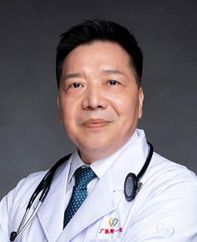

<!-- AUTO-GENERATED-BY: work/generate_obsidian_profiles.py -->

<!-- TEMPLATE: D:\workspace\信息收集整理\医生画像仓库\模板\医生画像模板.md -->

# 张挪富

## 基础信息

| 字段 | 内容 |
|---|---|
| 姓名 | 张挪富 |
| 医院 | 广州医科大学附属第一医院 |
| 科室 | 呼吸与危重症医学科 |
| 职称/身份 | 教授 主任医师 博士生导师 国务院特殊津贴专家 |
| 来源链接 | [官网原文](https://www.gyfyyy.cn/cn/ks/nk/hxnk/doctor_11.html) |
| 采集日期 | 2026-08-13 |

## 简介/擅长

慢性阻塞性肺疾病、哮喘、慢性咳嗽的诊治，尤其是鼾症和睡眠呼吸暂停综合症的诊治。

## 科研项目与成果

- 医院党委委员，中华医学会呼吸分会睡眠呼吸学组副组长、中国医师协会呼吸分会肺血管病工作委员会委员、广东省医学会呼吸分会睡眠呼吸学组副组长、广东省医师协会睡眠呼吸医师分会主任委员、广东省静脉血栓和肺栓塞防治联盟主席、武汉协和西院国家援鄂医疗队专家组组长、广东支援武汉协和西院ICU医疗队领队，主持多项国家省市项目，发表论文百余篇，获中国医师奖、广东省劳动模范等荣誉。

## 论文与学术产出

- 医院党委委员，中华医学会呼吸分会睡眠呼吸学组副组长、中国医师协会呼吸分会肺血管病工作委员会委员、广东省医学会呼吸分会睡眠呼吸学组副组长、广东省医师协会睡眠呼吸医师分会主任委员、广东省静脉血栓和肺栓塞防治联盟主席、武汉协和西院国家援鄂医疗队专家组组长、广东支援武汉协和西院ICU医疗队领队，主持多项国家省市项目，发表论文百余篇，获中国医师奖、广东省劳动模范等荣誉。

## 可包装亮点

- 医院党委委员，中华医学会呼吸分会睡眠呼吸学组副组长、中国医师协会呼吸分会肺血管病工作委员会委员、广东省医学会呼吸分会睡眠呼吸学组副组长、广东省医师协会睡眠呼吸医师分会主任委员、广东省静脉血栓和肺栓塞防治联盟主席、武汉协和西院国家援鄂医疗队专家组组长、广东支援武汉协和西院ICU医疗队领队，主持多项国家省市项目，发表论文百余篇，获中国医师奖、广东省劳动模范等荣…

## 重点疾病/人群标签

- 慢性病：慢性、危重
- 肿瘤：
- 生殖疾病：
- 免疫/风湿：
- 术后恢复/康复：
- 疑难重症：慢性、危重

## 证据摘录

> 只摘录官网公开信息中的短句或关键字段，不复制大段原文。

- 官网身份字段：教授 主任医师 博士生导师 国务院特殊津贴专家
- 官网简介/擅长：慢性阻塞性肺疾病、哮喘、慢性咳嗽的诊治，尤其是鼾症和睡眠呼吸暂停综合症的诊治。
- 官网亮眼经历线索：医院党委委员，中华医学会呼吸分会睡眠呼吸学组副组长、中国医师协会呼吸分会肺血管病工作委员会委员、广东省医学会呼吸分会睡眠呼吸学组副组长、广东省医师协会睡眠呼吸医师分会主任委员、广东省静脉血栓和肺栓塞防治联盟主席、武汉协和西院国家援鄂医疗队专家组组长、广东支援武汉协和西院ICU医疗队领队，主持多项国家省市项目，发表论文百余篇，获中国医师奖、广东省劳动模范等荣誉。
- 来源链接：https://www.gyfyyy.cn/cn/ks/nk/hxnk/doctor_11.html

## BD 画像摘要

张挪富医生可作为慢性病、疑难重症方向的基础画像候选。后续 BD 使用应继续以官网来源和人工复核为准，不添加疗效承诺或无来源包装。

## 合规边界

- 仅使用医院官网、官方公众号、官方小程序等公开渠道。
- 不采集私人电话、私人微信、家庭住址、患者隐私或非公开排班信息。
- 不写“保证治愈”“疗效第一”“包治疑难杂症”等无法由官网证明的表述。
