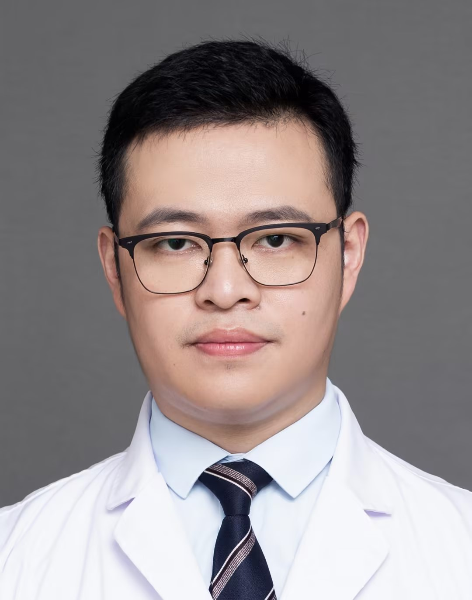

<!-- AUTO-GENERATED-BY: work/generate_obsidian_profiles.py -->

<!-- TEMPLATE: D:\workspace\信息收集整理\医生画像仓库\模板\医生画像模板.md -->

# 张楠

## 基础信息

| 字段 | 内容 |
|---|---|
| 姓名 | 张楠 |
| 医院 | 广州医科大学附属第一医院 |
| 科室 | 神经外科 |
| 职称/身份 | 主治医师 |
| 来源链接 | [官网原文](https://www.gyfyyy.cn/cn/ks/wk/sjwk/doctor_848.html) |
| 采集日期 | 2026-08-13 |

## 简介/擅长

1.垂体瘤、各部位脑膜瘤（尤其是矢状窦旁脑膜瘤和脑深部及复杂颅底脑膜瘤）、胶质瘤、脑转移瘤、神经鞘瘤、胆脂瘤等各种颅脑肿瘤的微侵袭显微外科治疗。2.缺血性脑血管病的外科治疗：包括颅内外联合搭桥治疗烟雾病和颈动脉内膜剥脱术。

## 教育与进修经历

- 主治医师，医学博士（硕士及博士均毕业于复旦大学附属华山医院神经外科），硕士研究生导师。

## 科研项目与成果

- 主持国家自然科学基金和省级自然科学基金等科研项目五项。

## 论文与学术产出

- 在SCI杂志和国内权威期刊上发表论文十余篇。

## 可包装亮点

- 主持国家自然科学基金和省级自然科学基金等科研项目五项。
- 在SCI杂志和国内权威期刊上发表论文十余篇。
- 曾获亚洲神经肿瘤学会（ASNO）青年科学家奖。
- 目前担任中国研究型医院学会MR脑功能学组委员和中国医学装备协会脑网络神经外科分会全国委员。

## 重点疾病/人群标签

- 慢性病：
- 肿瘤：肿瘤、瘤、复杂
- 生殖疾病：
- 免疫/风湿：
- 术后恢复/康复：
- 疑难重症：肿瘤、瘤、复杂

## 证据摘录

> 只摘录官网公开信息中的短句或关键字段，不复制大段原文。

- 官网身份字段：主治医师
- 官网简介/擅长：1.垂体瘤、各部位脑膜瘤（尤其是矢状窦旁脑膜瘤和脑深部及复杂颅底脑膜瘤）、胶质瘤、脑转移瘤、神经鞘瘤、胆脂瘤等各种颅脑肿瘤的微侵袭显微外科治疗。2.缺血性脑血管病的外科治疗：包括颅内外联合搭桥治疗烟雾病和颈动脉内膜剥脱术。
- 官网亮眼经历线索：主持国家自然科学基金和省级自然科学基金等科研项目五项。 在SCI杂志和国内权威期刊上发表论文十余篇。 曾获亚洲神经肿瘤学会（ASNO）青年科学家奖。 目前担任中国研究型医院学会MR脑功能学组委员和中国医学装备协会脑网络神经外科分会全国委员。
- 来源链接：https://www.gyfyyy.cn/cn/ks/wk/sjwk/doctor_848.html

## BD 画像摘要

张楠医生可作为肿瘤、疑难重症方向的基础画像候选。后续 BD 使用应继续以官网来源和人工复核为准，不添加疗效承诺或无来源包装。

## 合规边界

- 仅使用医院官网、官方公众号、官方小程序等公开渠道。
- 不采集私人电话、私人微信、家庭住址、患者隐私或非公开排班信息。
- 不写“保证治愈”“疗效第一”“包治疑难杂症”等无法由官网证明的表述。
