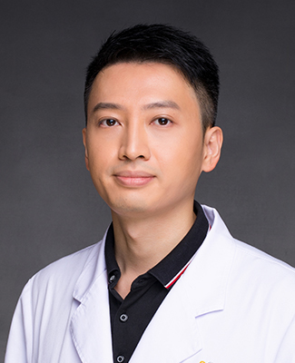

<!-- AUTO-GENERATED-BY: work/generate_obsidian_profiles.py -->

<!-- TEMPLATE: D:\workspace\信息收集整理\医生画像仓库\模板\医生画像模板.md -->

# 彭桂林

## 基础信息

| 字段 | 内容 |
|---|---|
| 姓名 | 彭桂林 |
| 医院 | 广州医科大学附属第一医院 |
| 科室 | 胸外科、器官移植科 |
| 职称/身份 | 器官移植科病区主任，副主任医师 |
| 来源链接 | [官网原文](https://www.gyfyyy.cn/cn/ks/wk/xwk/doctor_352.html) |
| 采集日期 | 2026-08-13 |

## 简介/擅长

肺癌微创外科治疗，肺气肿外科治疗，肺移植外科技术，胸外科术后快速康复。

## 教育与进修经历

- 医学博士，加拿大多伦多总医院器官移植中心访问学者，日本京都大学附属医院胸外科访问学者，广州市高层次人才。

## 可包装亮点

- 医学博士，加拿大多伦多总医院器官移植中心访问学者，日本京都大学附属医院胸外科访问学者，广州市高层次人才。

## 重点疾病/人群标签

- 慢性病：
- 肿瘤：肺癌、术后、康复
- 生殖疾病：
- 免疫/风湿：
- 术后恢复/康复：肺癌、术后、康复
- 疑难重症：

## 证据摘录

> 只摘录官网公开信息中的短句或关键字段，不复制大段原文。

- 官网身份字段：器官移植科病区主任，副主任医师
- 官网简介/擅长：肺癌微创外科治疗，肺气肿外科治疗，肺移植外科技术，胸外科术后快速康复。
- 官网亮眼经历线索：医学博士，加拿大多伦多总医院器官移植中心访问学者，日本京都大学附属医院胸外科访问学者，广州市高层次人才。
- 来源链接：https://www.gyfyyy.cn/cn/ks/wk/xwk/doctor_352.html

## BD 画像摘要

彭桂林医生可作为肿瘤、术后恢复/康复方向的基础画像候选。后续 BD 使用应继续以官网来源和人工复核为准，不添加疗效承诺或无来源包装。

## 合规边界

- 仅使用医院官网、官方公众号、官方小程序等公开渠道。
- 不采集私人电话、私人微信、家庭住址、患者隐私或非公开排班信息。
- 不写“保证治愈”“疗效第一”“包治疑难杂症”等无法由官网证明的表述。
