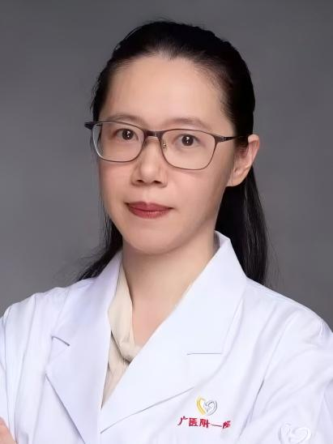

<!-- AUTO-GENERATED-BY: work/generate_obsidian_profiles.py -->

<!-- TEMPLATE: D:\workspace\信息收集整理\医生画像仓库\模板\医生画像模板.md -->

# 徐惠茵

## 基础信息

| 字段 | 内容 |
|---|---|
| 姓名 | 徐惠茵 |
| 医院 | 广州医科大学附属第一医院 |
| 科室 | 药学部 |
| 职称/身份 | 主管药师 |
| 来源链接 | [官网原文](https://www.gyfyyy.cn/cn/ks/yj/yxb/doctor_915.html) |
| 采集日期 | 2026-08-13 |

## 简介/擅长

专注于“药械通”政策下创新药械的精准药学服务。擅长其临床应用评估、用药指导、不良反应防治及疗效监护，致力于为患者提供个体化的全程用药管理，保障用药安全、有效与经济。

## 教育与进修经历

- 教育经历：中山大学新华学院毕业，获得理学学士学位 “药械通”政策为临床急需的境外上市新药、医疗器械开通了快速审批通道，让广大患者能及早用上国际先进的治疗产品。

## 可包装亮点

- 徐惠茵 主管药师 擅长:专注于“药械通”政策下创新药械的精准药学服务。

## 重点疾病/人群标签

- 慢性病：
- 肿瘤：
- 生殖疾病：
- 免疫/风湿：
- 术后恢复/康复：
- 疑难重症：

## 证据摘录

> 只摘录官网公开信息中的短句或关键字段，不复制大段原文。

- 官网身份字段：主管药师
- 官网简介/擅长：专注于“药械通”政策下创新药械的精准药学服务。擅长其临床应用评估、用药指导、不良反应防治及疗效监护，致力于为患者提供个体化的全程用药管理，保障用药安全、有效与经济。
- 官网亮眼经历线索：徐惠茵 主管药师 擅长:专注于“药械通”政策下创新药械的精准药学服务。
- 异常提示：职称/身份需人工复核
- 来源链接：https://www.gyfyyy.cn/cn/ks/yj/yxb/doctor_915.html

## BD 画像摘要

徐惠茵医生可作为广州医科大学附属第一医院药学部的基础医生资料入库。当前重点方向以总底表标签为准，官网未展示的信息保持空白。

## 合规边界

- 仅使用医院官网、官方公众号、官方小程序等公开渠道。
- 不采集私人电话、私人微信、家庭住址、患者隐私或非公开排班信息。
- 不写“保证治愈”“疗效第一”“包治疑难杂症”等无法由官网证明的表述。
