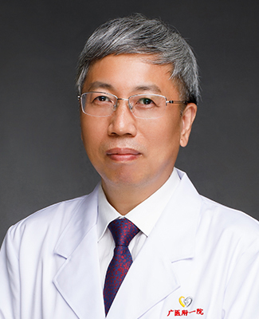

<!-- AUTO-GENERATED-BY: work/generate_obsidian_profiles.py -->

<!-- TEMPLATE: D:\workspace\信息收集整理\医生画像仓库\模板\医生画像模板.md -->

# 曾国华

## 基础信息

| 字段 | 内容 |
|---|---|
| 姓名 | 曾国华 |
| 医院 | 广州医科大学附属第一医院 |
| 科室 | 泌尿外科 |
| 职称/身份 | 泌尿外科学科带头人，二级教授 主任医师 博士研究生导师 |
| 来源链接 | [官网原文](https://www.gyfyyy.cn/cn/ks/wk/bnwk/doctor_118.html) |
| 采集日期 | 2026-08-13 |

## 简介/擅长

尿路梗阻、泌尿系肿瘤等疾病的诊疗，尤其擅长复杂性肾结石、输尿管狭窄、前列腺增生的微创治疗，泌尿系肿瘤的微创根治手术及达芬奇机器人手术。

## 教育与进修经历

- Ø 率先在国内建立了泌尿外科微创培训中心，近五年举办了53期泌尿微创技术培训班，其中国际培训班22期，培训中国泌尿外科医生8505人次， 国际泌尿外科医生697人次。

## 科研项目与成果

- Ø 广州医科大学附属第一医院泌尿外科学科带头人、广东省泌尿外科重点实验室主任，泌尿微创手术机器人与智能装备广东省工程研究中心主任；

## 可包装亮点

- 曾国华教授 Ø 二级教授、主任医师、博士研究生导师；
- Ø 广州医科大学附属第一医院泌尿外科学科带头人、广东省泌尿外科重点实验室主任，泌尿微创手术机器人与智能装备广东省工程研究中心主任；
- Ø 国际腔内泌尿外科学会常委兼Fellowship 中心主任；
- Ø 中国医师协会泌尿外科分会副会长；

## 重点疾病/人群标签

- 慢性病：
- 肿瘤：肿瘤、复杂
- 生殖疾病：
- 免疫/风湿：
- 术后恢复/康复：
- 疑难重症：肿瘤、复杂

## 证据摘录

> 只摘录官网公开信息中的短句或关键字段，不复制大段原文。

- 官网身份字段：泌尿外科学科带头人，二级教授 主任医师 博士研究生导师
- 官网简介/擅长：尿路梗阻、泌尿系肿瘤等疾病的诊疗，尤其擅长复杂性肾结石、输尿管狭窄、前列腺增生的微创治疗，泌尿系肿瘤的微创根治手术及达芬奇机器人手术。
- 官网亮眼经历线索：曾国华教授 Ø 二级教授、主任医师、博士研究生导师； Ø 广州医科大学附属第一医院泌尿外科学科带头人、广东省泌尿外科重点实验室主任，泌尿微创手术机器人与智能装备广东省工程研究中心主任； Ø 国际腔内泌尿外科学会常委兼Fellowship 中心主任； Ø 中国医师协会泌尿外科分会副会长；
- 来源链接：https://www.gyfyyy.cn/cn/ks/wk/bnwk/doctor_118.html

## BD 画像摘要

曾国华医生可作为肿瘤、疑难重症方向的基础画像候选。后续 BD 使用应继续以官网来源和人工复核为准，不添加疗效承诺或无来源包装。

## 合规边界

- 仅使用医院官网、官方公众号、官方小程序等公开渠道。
- 不采集私人电话、私人微信、家庭住址、患者隐私或非公开排班信息。
- 不写“保证治愈”“疗效第一”“包治疑难杂症”等无法由官网证明的表述。
