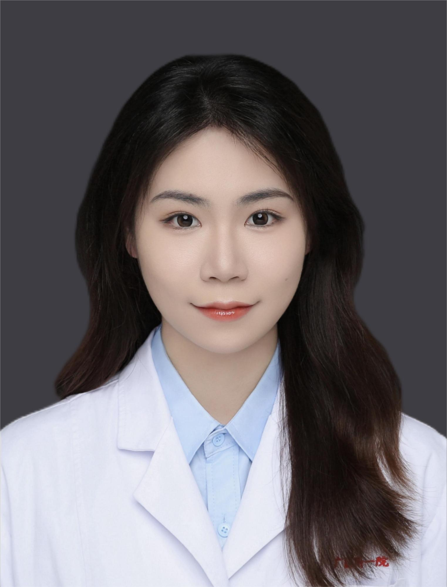

<!-- AUTO-GENERATED-BY: work/generate_obsidian_profiles.py -->

<!-- TEMPLATE: D:\workspace\信息收集整理\医生画像仓库\模板\医生画像模板.md -->

# 李澄

## 基础信息

| 字段 | 内容 |
|---|---|
| 姓名 | 李澄 |
| 医院 | 广州医科大学附属第一医院 |
| 科室 | 口腔科 |
| 职称/身份 | 医师 |
| 来源链接 | [官网原文](https://www.gyfyyy.cn/cn/ks/qtzk/kqk/doctor_830.html) |
| 采集日期 | 2026-08-13 |

## 简介/擅长

口腔常见病的诊疗，包括牙体缺损、牙列缺损、龋病、牙髓病、阻生齿、牙周病、根尖周病等。掌握全冠及桩核冠修复，前牙美学修复，前、后牙直接充填修复，根管治疗，阻生齿微创拔除，牙周病序列治疗等。

## 教育与进修经历

- 职称:医师 教育经历:华中科技大学硕士研究生毕业，获得口腔医学专业学位

## 可包装亮点

- 口腔常见病的诊疗，包括牙体缺损、牙列缺损、龋病、牙髓病、阻生齿、牙周病、根尖周病等。
- 掌握全冠及桩核冠修复，前牙美学修复，前、后牙直接充填修复，根管治疗，阻生齿微创拔除，牙周病序列治疗等。

## 重点疾病/人群标签

- 慢性病：
- 肿瘤：
- 生殖疾病：
- 免疫/风湿：
- 术后恢复/康复：
- 疑难重症：

## 证据摘录

> 只摘录官网公开信息中的短句或关键字段，不复制大段原文。

- 官网身份字段：医师
- 官网简介/擅长：口腔常见病的诊疗，包括牙体缺损、牙列缺损、龋病、牙髓病、阻生齿、牙周病、根尖周病等。掌握全冠及桩核冠修复，前牙美学修复，前、后牙直接充填修复，根管治疗，阻生齿微创拔除，牙周病序列治疗等。
- 来源链接：https://www.gyfyyy.cn/cn/ks/qtzk/kqk/doctor_830.html

## BD 画像摘要

李澄医生可作为广州医科大学附属第一医院口腔科的基础医生资料入库。当前重点方向以总底表标签为准，官网未展示的信息保持空白。

## 合规边界

- 仅使用医院官网、官方公众号、官方小程序等公开渠道。
- 不采集私人电话、私人微信、家庭住址、患者隐私或非公开排班信息。
- 不写“保证治愈”“疗效第一”“包治疑难杂症”等无法由官网证明的表述。
