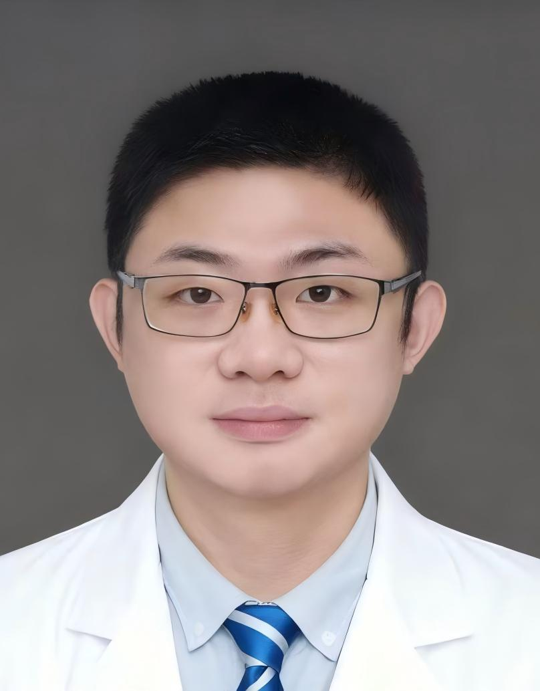

<!-- AUTO-GENERATED-BY: work/generate_obsidian_profiles.py -->

<!-- TEMPLATE: D:\workspace\信息收集整理\医生画像仓库\模板\医生画像模板.md -->

# 杨凯帆

## 基础信息

| 字段 | 内容 |
|---|---|
| 姓名 | 杨凯帆 |
| 医院 | 广州医科大学附属第一医院 |
| 科室 | 关节外科 |
| 职称/身份 | 医师 |
| 来源链接 | [官网原文](https://www.gyfyyy.cn/cn/ks/wk/gjwk/doctor_919.html) |
| 采集日期 | 2026-08-13 |

## 简介/擅长

四肢骨折，老年退行性疾病， 运动损伤，髋膝关节痛，髋膝骨性关节炎，半月板损伤，膝关节韧带损伤等。

## 教育与进修经历

- 简介: 医学博士， 博士后， 主持国家自然科学基金青年项目，博士后基金面上项目，广东省自然科学基金等科研项目3项， 在国际期刊发表SCl论文6篇 ，多次参与国内高水平学术活动并进行大会发言 。

## 科研项目与成果

- 简介: 医学博士， 博士后， 主持国家自然科学基金青年项目，博士后基金面上项目，广东省自然科学基金等科研项目3项， 在国际期刊发表SCl论文6篇 ，多次参与国内高水平学术活动并进行大会发言 。

## 论文与学术产出

- 简介: 医学博士， 博士后， 主持国家自然科学基金青年项目，博士后基金面上项目，广东省自然科学基金等科研项目3项， 在国际期刊发表SCl论文6篇 ，多次参与国内高水平学术活动并进行大会发言 。

## 可包装亮点

- 简介: 医学博士， 博士后， 主持国家自然科学基金青年项目，博士后基金面上项目，广东省自然科学基金等科研项目3项， 在国际期刊发表SCl论文6篇 ，多次参与国内高水平学术活动并进行大会发言 。

## 重点疾病/人群标签

- 慢性病：
- 肿瘤：
- 生殖疾病：
- 免疫/风湿：
- 术后恢复/康复：
- 疑难重症：

## 证据摘录

> 只摘录官网公开信息中的短句或关键字段，不复制大段原文。

- 官网身份字段：医师
- 官网简介/擅长：四肢骨折，老年退行性疾病， 运动损伤，髋膝关节痛，髋膝骨性关节炎，半月板损伤，膝关节韧带损伤等。
- 官网亮眼经历线索：简介: 医学博士， 博士后， 主持国家自然科学基金青年项目，博士后基金面上项目，广东省自然科学基金等科研项目3项， 在国际期刊发表SCl论文6篇 ，多次参与国内高水平学术活动并进行大会发言 。
- 来源链接：https://www.gyfyyy.cn/cn/ks/wk/gjwk/doctor_919.html

## BD 画像摘要

杨凯帆医生可作为广州医科大学附属第一医院关节外科的基础医生资料入库。当前重点方向以总底表标签为准，官网未展示的信息保持空白。

## 合规边界

- 仅使用医院官网、官方公众号、官方小程序等公开渠道。
- 不采集私人电话、私人微信、家庭住址、患者隐私或非公开排班信息。
- 不写“保证治愈”“疗效第一”“包治疑难杂症”等无法由官网证明的表述。
