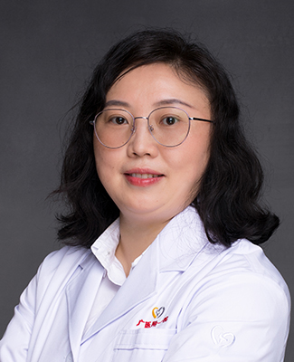

<!-- AUTO-GENERATED-BY: work/generate_obsidian_profiles.py -->

<!-- TEMPLATE: D:\workspace\信息收集整理\医生画像仓库\模板\医生画像模板.md -->

# 杨晔

## 基础信息

| 字段 | 内容 |
|---|---|
| 姓名 | 杨晔 |
| 医院 | 广州医科大学附属第一医院 |
| 科室 | 眼科 |
| 职称/身份 | 副主任医师 |
| 来源链接 | [官网原文](https://www.gyfyyy.cn/cn/ks/qtzk/yk/doctor_329.html) |
| 采集日期 | 2026-08-13 |

## 简介/擅长

在眼科常见病如角膜炎，白内障，青光眼，视网膜病变等诊治方面积累了丰富的经验；对于眼科疑难疾病的诊治具有较高的水平。尤其擅长白内障疾病的诊断及超声乳化手术治疗。

## 教育与进修经历

- 毕业于中山大学中山眼科中心白内障专业。

## 可包装亮点

- 从事眼科临床工作近20年，尤其擅长白内障超声乳化手术治疗及功能性人工晶状体植入的精准治疗。
- 中国民族医药学会眼科分会会员 广东省视光学学会视光教育专业委员会委员 广东省眼健康协会会员 广东省精准医学会视觉健康分会会员 广州市医师协会眼科分会会员

## 重点疾病/人群标签

- 慢性病：
- 肿瘤：
- 生殖疾病：
- 免疫/风湿：
- 术后恢复/康复：
- 疑难重症：疑难

## 证据摘录

> 只摘录官网公开信息中的短句或关键字段，不复制大段原文。

- 官网身份字段：副主任医师
- 官网简介/擅长：在眼科常见病如角膜炎，白内障，青光眼，视网膜病变等诊治方面积累了丰富的经验；对于眼科疑难疾病的诊治具有较高的水平。尤其擅长白内障疾病的诊断及超声乳化手术治疗。
- 官网亮眼经历线索：从事眼科临床工作近20年，尤其擅长白内障超声乳化手术治疗及功能性人工晶状体植入的精准治疗。 中国民族医药学会眼科分会会员 广东省视光学学会视光教育专业委员会委员 广东省眼健康协会会员 广东省精准医学会视觉健康分会会员 广州市医师协会眼科分会会员
- 来源链接：https://www.gyfyyy.cn/cn/ks/qtzk/yk/doctor_329.html

## BD 画像摘要

杨晔医生可作为疑难重症方向的基础画像候选。后续 BD 使用应继续以官网来源和人工复核为准，不添加疗效承诺或无来源包装。

## 合规边界

- 仅使用医院官网、官方公众号、官方小程序等公开渠道。
- 不采集私人电话、私人微信、家庭住址、患者隐私或非公开排班信息。
- 不写“保证治愈”“疗效第一”“包治疑难杂症”等无法由官网证明的表述。
