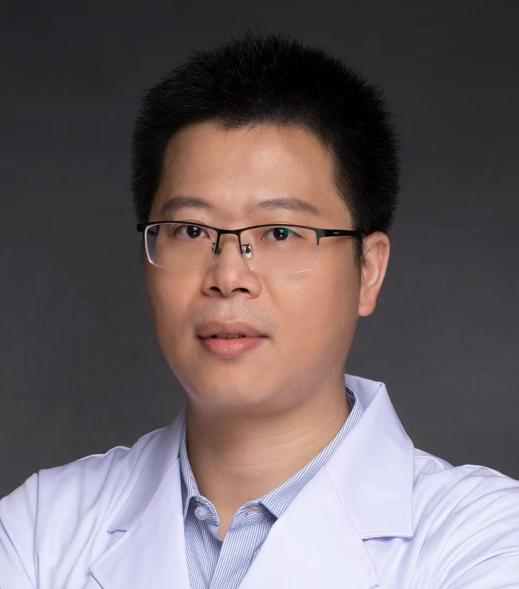

<!-- AUTO-GENERATED-BY: work/generate_obsidian_profiles.py -->

<!-- TEMPLATE: D:\workspace\信息收集整理\医生画像仓库\模板\医生画像模板.md -->

# 杨洪伟

## 基础信息

| 字段 | 内容 |
|---|---|
| 姓名 | 杨洪伟 |
| 医院 | 广州医科大学附属第一医院 |
| 科室 | 超声医学科 |
| 职称/身份 | 超声医学科副主任，主任医师 硕士研究生导师 |
| 来源链接 | [官网原文](https://www.gyfyyy.cn/cn/ks/yj/csyxk/doctor_879.html) |
| 采集日期 | 2026-08-13 |

## 简介/擅长

产前超声诊断、盆底超声检测、不孕不育超声评估（含输卵管造影）、妇产介入性超声与超声造影

## 教育与进修经历

- 专业特长：妇产、腹部、浅表超声医学影像，尤其对于妇产专业疑难、复杂疾病超声检测具有较高的诊断水平 任职： 广州医科大学附属第一医院超声医学科副主任 医学博士 主任医师硕士研究生导师 香港威尔斯亲王医院访问学者 第十届“羊城好医生” 广东省第二届产前诊断技术专家库成员 广州市超声诊断专业质量控制中心委员兼秘书 广东省医疗行业协会超声医学管理分会副主任委员 广东省医师协会超声医师分会常委 广州市医学会超声医学分会常委

## 可包装亮点

- 专业特长：妇产、腹部、浅表超声医学影像，尤其对于妇产专业疑难、复杂疾病超声检测具有较高的诊断水平 任职： 广州医科大学附属第一医院超声医学科副主任 医学博士 主任医师硕士研究生导师 香港威尔斯亲王医院访问学者 第十届“羊城好医生” 广东省第二届产前诊断技术专家库成员 广州市超声诊断专业质量控制中心委员兼秘书 广东省医疗行业协会超声医学管理分会副主任委员 广…

## 重点疾病/人群标签

- 慢性病：
- 肿瘤：
- 生殖疾病：不孕、疑难、复杂
- 免疫/风湿：
- 术后恢复/康复：
- 疑难重症：不孕、疑难、复杂

## 证据摘录

> 只摘录官网公开信息中的短句或关键字段，不复制大段原文。

- 官网身份字段：超声医学科副主任，主任医师 硕士研究生导师
- 官网简介/擅长：产前超声诊断、盆底超声检测、不孕不育超声评估（含输卵管造影）、妇产介入性超声与超声造影
- 官网亮眼经历线索：专业特长：妇产、腹部、浅表超声医学影像，尤其对于妇产专业疑难、复杂疾病超声检测具有较高的诊断水平 任职： 广州医科大学附属第一医院超声医学科副主任 医学博士 主任医师硕士研究生导师 香港威尔斯亲王医院访问学者 第十届“羊城好医生” 广东省第二届产前诊断技术专家库成员 广州市超声诊断专业质量控制中心委员兼秘书 广东省医疗行业协会超声医学管理分会副主任委员 广东省医师协会超声医师分会常委 广州市医学会超声医学分会常委
- 来源链接：https://www.gyfyyy.cn/cn/ks/yj/csyxk/doctor_879.html

## BD 画像摘要

杨洪伟医生可作为生殖疾病、疑难重症方向的基础画像候选。后续 BD 使用应继续以官网来源和人工复核为准，不添加疗效承诺或无来源包装。

## 合规边界

- 仅使用医院官网、官方公众号、官方小程序等公开渠道。
- 不采集私人电话、私人微信、家庭住址、患者隐私或非公开排班信息。
- 不写“保证治愈”“疗效第一”“包治疑难杂症”等无法由官网证明的表述。
