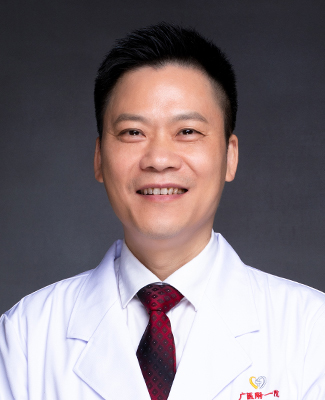

<!-- AUTO-GENERATED-BY: work/generate_obsidian_profiles.py -->

<!-- TEMPLATE: D:\workspace\信息收集整理\医生画像仓库\模板\医生画像模板.md -->

# 梁子敬

## 基础信息

| 字段 | 内容 |
|---|---|
| 姓名 | 梁子敬 |
| 医院 | 广州医科大学附属第一医院 |
| 科室 | 急诊科 |
| 职称/身份 | 教授 主任医师 博士生导师 |
| 来源链接 | [官网原文](https://www.gyfyyy.cn/cn/ks/jzk/doctor_245.html) |
| 采集日期 | 2026-08-13 |

## 简介/擅长

心、肺、脑、血管急症诊治、中毒诊治、毒蛇伤诊治，咳嗽、痛风等慢性疾病诊治。

## 论文与学术产出

- 《中华急诊医学杂志》、《中国急救杂志》、《实用内科学杂志》、《中华卫生应急杂志》、《中华临床医师杂志》、《蛇志》编委，主编，参编多本专著，发表论文百余篇。

## 可包装亮点

- 急诊医学教授，主任医师，博士生导师。
- 急诊科及全科医学科带头人，广东省全科医学领军人才，广州蛇毒与生物毒素研究所临床部主任，广东省中西医结合学会蛇伤专业委员会主任委员，广东省精准医学应用学会毒物与中毒分会主任委员，中华医学会急诊医学分会中毒学组委员。
- 广州市医师协会危重症分会候任主任委员，广东省医师协会急诊医学分会副主任委员，广东省医学会应急医学分会副主任委员，广东省精准医学应用学会急危重症分会副主任委员。
- 《中华急诊医学杂志》、《中国急救杂志》、《实用内科学杂志》、《中华卫生应急杂志》、《中华临床医师杂志》、《蛇志》编委，主编，参编多本专著，发表论文百余篇。

## 重点疾病/人群标签

- 慢性病：慢性、危重、急危重
- 肿瘤：
- 生殖疾病：
- 免疫/风湿：
- 术后恢复/康复：
- 疑难重症：慢性、危重、急危重

## 证据摘录

> 只摘录官网公开信息中的短句或关键字段，不复制大段原文。

- 官网身份字段：教授 主任医师 博士生导师
- 官网简介/擅长：心、肺、脑、血管急症诊治、中毒诊治、毒蛇伤诊治，咳嗽、痛风等慢性疾病诊治。
- 官网亮眼经历线索：急诊医学教授，主任医师，博士生导师。 急诊科及全科医学科带头人，广东省全科医学领军人才，广州蛇毒与生物毒素研究所临床部主任，广东省中西医结合学会蛇伤专业委员会主任委员，广东省精准医学应用学会毒物与中毒分会主任委员，中华医学会急诊医学分会中毒学组委员。 广州市医师协会危重症分会候任主任委员，广东省医师协会急诊医学分会副主任委员，广东省医学会应急医学分会副主任委员，广东省精准医学应用学会急危重症分会副主任委员。 《中华急诊医学杂志》、《中…
- 来源链接：https://www.gyfyyy.cn/cn/ks/jzk/doctor_245.html

## BD 画像摘要

梁子敬医生可作为慢性病、疑难重症方向的基础画像候选。后续 BD 使用应继续以官网来源和人工复核为准，不添加疗效承诺或无来源包装。

## 合规边界

- 仅使用医院官网、官方公众号、官方小程序等公开渠道。
- 不采集私人电话、私人微信、家庭住址、患者隐私或非公开排班信息。
- 不写“保证治愈”“疗效第一”“包治疑难杂症”等无法由官网证明的表述。
