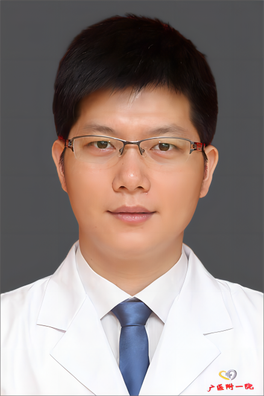

<!-- AUTO-GENERATED-BY: work/generate_obsidian_profiles.py -->

<!-- TEMPLATE: D:\workspace\信息收集整理\医生画像仓库\模板\医生画像模板.md -->

# 温广明

## 基础信息

| 字段 | 内容 |
|---|---|
| 姓名 | 温广明 |
| 医院 | 广州医科大学附属第一医院 |
| 科室 | 胃肠外科 |
| 职称/身份 | 副主任医师 |
| 来源链接 | [官网原文](https://www.gyfyyy.cn/cn/ks/wk/wcwk/doctor_392.html) |
| 采集日期 | 2026-08-13 |

## 简介/擅长

甲状腺良性疾病及甲状腺癌根治性手术和综合治疗；腹股沟疝的微创手术，腹壁切口疝、切口旁疝等复杂性疝的手术治疗；胃肠肛门外科疾病（胃肠肿瘤、消化道穿孔、阑尾炎、痔疮等）、乳腺疾病、肝胆疾病的微创手术及综合治疗。

## 教育与进修经历

- 职称:副主任医师 教育经历:广州医学院大学毕业，获得医学硕士学位

## 可包装亮点

- 职称:副主任医师 教育经历:广州医学院大学毕业，获得医学硕士学位

## 重点疾病/人群标签

- 慢性病：
- 肿瘤：肿瘤、癌、复杂
- 生殖疾病：
- 免疫/风湿：
- 术后恢复/康复：
- 疑难重症：肿瘤、癌、复杂

## 证据摘录

> 只摘录官网公开信息中的短句或关键字段，不复制大段原文。

- 官网身份字段：副主任医师
- 官网简介/擅长：甲状腺良性疾病及甲状腺癌根治性手术和综合治疗；腹股沟疝的微创手术，腹壁切口疝、切口旁疝等复杂性疝的手术治疗；胃肠肛门外科疾病（胃肠肿瘤、消化道穿孔、阑尾炎、痔疮等）、乳腺疾病、肝胆疾病的微创手术及综合治疗。
- 官网亮眼经历线索：职称:副主任医师 教育经历:广州医学院大学毕业，获得医学硕士学位
- 来源链接：https://www.gyfyyy.cn/cn/ks/wk/wcwk/doctor_392.html

## BD 画像摘要

温广明医生可作为肿瘤、疑难重症方向的基础画像候选。后续 BD 使用应继续以官网来源和人工复核为准，不添加疗效承诺或无来源包装。

## 合规边界

- 仅使用医院官网、官方公众号、官方小程序等公开渠道。
- 不采集私人电话、私人微信、家庭住址、患者隐私或非公开排班信息。
- 不写“保证治愈”“疗效第一”“包治疑难杂症”等无法由官网证明的表述。
