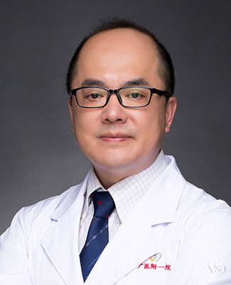

<!-- AUTO-GENERATED-BY: work/generate_obsidian_profiles.py -->

<!-- TEMPLATE: D:\workspace\信息收集整理\医生画像仓库\模板\医生画像模板.md -->

# 王凯

## 基础信息

| 字段 | 内容 |
|---|---|
| 姓名 | 王凯 |
| 医院 | 广州医科大学附属第一医院 |
| 科室 | 心脏外科 |
| 职称/身份 | 心脏外科主任，主任医师 |
| 来源链接 | [官网原文](https://www.gyfyyy.cn/cn/ks/wk/xzwk/doctor_363.html) |
| 采集日期 | 2026-08-13 |

## 简介/擅长

各种主动脉疾病的外科治疗尤其在主动脉夹层及主动脉瘤手术方面经验丰富，在冠状动脉搭桥手术、心脏瓣膜微创手术、心律失常的外科治疗及心脏移植、心肺联合移植、人工心脏方面有很深的造诣。

## 可包装亮点

- 王凯 主任医师、博士 硕士生导师 广州医科大学附属第一医院心脏大血管外科成人心脏手术组组长 中国医师协会心血管外科分会先天性心脏病学术委员会 委员 广东省医师协会血管外科分会 常委 广东省生物医学工程学会胸心血管外科分会 委员 广东省医院管理协会心脏血管微创外科 常委 广州市医学会胸心外科分会 常委

## 重点疾病/人群标签

- 慢性病：
- 肿瘤：瘤
- 生殖疾病：
- 免疫/风湿：
- 术后恢复/康复：
- 疑难重症：

## 证据摘录

> 只摘录官网公开信息中的短句或关键字段，不复制大段原文。

- 官网身份字段：心脏外科主任，主任医师
- 官网简介/擅长：各种主动脉疾病的外科治疗尤其在主动脉夹层及主动脉瘤手术方面经验丰富，在冠状动脉搭桥手术、心脏瓣膜微创手术、心律失常的外科治疗及心脏移植、心肺联合移植、人工心脏方面有很深的造诣。
- 官网亮眼经历线索：王凯 主任医师、博士 硕士生导师 广州医科大学附属第一医院心脏大血管外科成人心脏手术组组长 中国医师协会心血管外科分会先天性心脏病学术委员会 委员 广东省医师协会血管外科分会 常委 广东省生物医学工程学会胸心血管外科分会 委员 广东省医院管理协会心脏血管微创外科 常委 广州市医学会胸心外科分会 常委
- 来源链接：https://www.gyfyyy.cn/cn/ks/wk/xzwk/doctor_363.html

## BD 画像摘要

王凯医生可作为肿瘤方向的基础画像候选。后续 BD 使用应继续以官网来源和人工复核为准，不添加疗效承诺或无来源包装。

## 合规边界

- 仅使用医院官网、官方公众号、官方小程序等公开渠道。
- 不采集私人电话、私人微信、家庭住址、患者隐私或非公开排班信息。
- 不写“保证治愈”“疗效第一”“包治疑难杂症”等无法由官网证明的表述。
