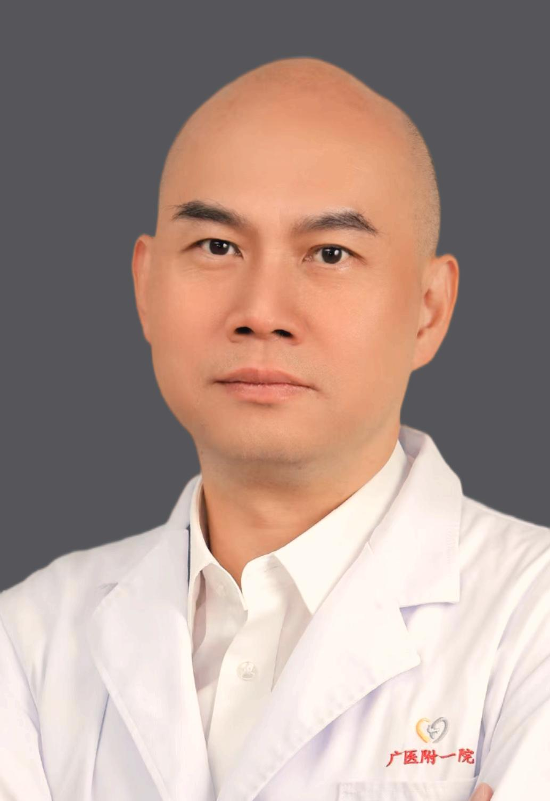

<!-- AUTO-GENERATED-BY: work/generate_obsidian_profiles.py -->

<!-- TEMPLATE: D:\workspace\信息收集整理\医生画像仓库\模板\医生画像模板.md -->

# 苏义基

## 基础信息

| 字段 | 内容 |
|---|---|
| 姓名 | 苏义基 |
| 医院 | 广州医科大学附属第一医院 |
| 科室 | 康复科 |
| 职称/身份 | 康复科主任，主任医师 |
| 来源链接 | [官网原文](https://www.gyfyyy.cn/cn/ks/qtzk/kfk/doctor_869.html) |
| 采集日期 | 2026-08-13 |

## 简介/擅长

颈椎病、肩袖损伤、肩周炎、腰椎间盘突出症、腰椎椎管狭窄症、脊柱侧弯，骨关节炎、半月板损伤、踝关节扭伤、关节置换术后功能障碍、脊髓损伤、脑外伤、脑卒中、骨折等的快速康复治疗。

## 教育与进修经历

- 医学博士，主任医师，硕士研究生导师，曾留学日本研修康复，现就职于广州医科大学附属第一医院康复医学科，学术任职包括：首届中国研究型医院学会骨科创新与专业委员会骨科康复学组委员、广西医师协会康复医师分会副主任委员、广西康复医学会第三届理事会理事、广西康复医学会骨与关节专业委员会副主任委员、广西康复医学会重症康复专业委员会副主任委员、广西康复医学会康复教育专业委员会副主任委员、广西康复医学会脊柱脊髓专业委员会秘书长、广西医学会物理医学与康复医学分会第七届委员会委员、广州市医院协会康复管理分会第一届委员会常务委员。

## 科研项目与成果

- 主持各级课题8项（其中主持和主要参与国家自然科学基金各1项），在各级专业杂志发表学术论文二十余篇，其中SCI论文7篇。

## 论文与学术产出

- 主持各级课题8项（其中主持和主要参与国家自然科学基金各1项），在各级专业杂志发表学术论文二十余篇，其中SCI论文7篇。

## 可包装亮点

- 医学博士，主任医师，硕士研究生导师，曾留学日本研修康复，现就职于广州医科大学附属第一医院康复医学科，学术任职包括：首届中国研究型医院学会骨科创新与专业委员会骨科康复学组委员、广西医师协会康复医师分会副主任委员、广西康复医学会第三届理事会理事、广西康复医学会骨与关节专业委员会副主任委员、广西康复医学会重症康复专业委员会副主任委员、广西康复医学会康复教育专业委…
- 主持各级课题8项（其中主持和主要参与国家自然科学基金各1项），在各级专业杂志发表学术论文二十余篇，其中SCI论文7篇。
- 科室: 康复医学科 职称: 主任医师 开诊专科名称：康复科门诊 亚专科名称： 内外科疾病快速康复

## 重点疾病/人群标签

- 慢性病：
- 肿瘤：
- 生殖疾病：
- 免疫/风湿：
- 术后恢复/康复：术后、康复、疼痛、功能障碍、重症
- 疑难重症：术后、康复、疼痛、功能障碍、重症

## 证据摘录

> 只摘录官网公开信息中的短句或关键字段，不复制大段原文。

- 官网身份字段：康复科主任，主任医师
- 官网简介/擅长：颈椎病、肩袖损伤、肩周炎、腰椎间盘突出症、腰椎椎管狭窄症、脊柱侧弯，骨关节炎、半月板损伤、踝关节扭伤、关节置换术后功能障碍、脊髓损伤、脑外伤、脑卒中、骨折等的快速康复治疗。
- 官网亮眼经历线索：医学博士，主任医师，硕士研究生导师，曾留学日本研修康复，现就职于广州医科大学附属第一医院康复医学科，学术任职包括：首届中国研究型医院学会骨科创新与专业委员会骨科康复学组委员、广西医师协会康复医师分会副主任委员、广西康复医学会第三届理事会理事、广西康复医学会骨与关节专业委员会副主任委员、广西康复医学会重症康复专业委员会副主任委员、广西康复医学会康复教育专业委员会副主任委员、广西康复医学会脊柱脊髓专业委员会秘书长、广西医学会物理医学与康复…
- 来源链接：https://www.gyfyyy.cn/cn/ks/qtzk/kfk/doctor_869.html

## BD 画像摘要

苏义基医生可作为术后恢复/康复、疑难重症方向的基础画像候选。后续 BD 使用应继续以官网来源和人工复核为准，不添加疗效承诺或无来源包装。

## 合规边界

- 仅使用医院官网、官方公众号、官方小程序等公开渠道。
- 不采集私人电话、私人微信、家庭住址、患者隐私或非公开排班信息。
- 不写“保证治愈”“疗效第一”“包治疑难杂症”等无法由官网证明的表述。
