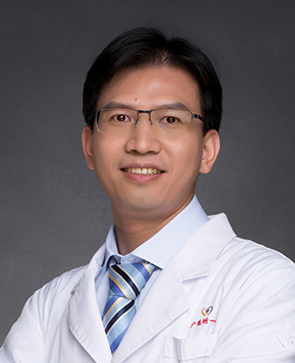

<!-- AUTO-GENERATED-BY: work/generate_obsidian_profiles.py -->

<!-- TEMPLATE: D:\workspace\信息收集整理\医生画像仓库\模板\医生画像模板.md -->

# 范良生

## 基础信息

| 字段 | 内容 |
|---|---|
| 姓名 | 范良生 |
| 医院 | 广州医科大学附属第一医院 |
| 科室 | 妇科 |
| 职称/身份 | 妇产科主任，副教授 副主任医师 博士后合作导师 |
| 来源链接 | [官网原文](https://www.gyfyyy.cn/cn/ks/fck/fk/doctor_615.html) |
| 采集日期 | 2026-08-13 |

## 简介/擅长

妇科良恶性肿瘤、宫颈病变、子宫畸形、子宫内膜异位症、子宫内膜病变、不孕症等的诊治；重点致力于妇科肿瘤（卵巢癌、宫颈癌、子宫内膜癌等）疑难疾病的诊治；在妇科各类开腹手术及疑难宫腔镜、腹腔镜、达芬奇机器人手术方面具有丰富的经验。

## 教育与进修经历

- 范良生，男，中共党员，妇产科主任，临床医学博士，副教授，硕士研究生导师（专业型/学术型），博士后合作导师，广州市高层次人才（青年后备）。

## 科研项目与成果

- 长期致力于妇产科临床、教学和科研工作，主要研究领域为妇科肿瘤学、肿瘤分子生物学，主要研究方向为HPV感染相关宫颈病变、妇科肿瘤发生发展与转移相关分子机制研究。

## 可包装亮点

- 范良生，男，中共党员，妇产科主任，临床医学博士，副教授，硕士研究生导师（专业型/学术型），博士后合作导师，广州市高层次人才（青年后备）。
- 重点致力于妇科肿瘤（卵巢癌、宫颈癌、子宫内膜癌等）疑难疾病的诊治；
- 在妇科各类开腹手术及疑难宫腔镜、腹腔镜、达芬奇机器人手术方面具有丰富的经验。
- 社会任职：广东省医学会妇产科学分会青年委员，广东省医学会妇科肿瘤学分会委员，广东省健康管理学会妇科肿瘤MDT专业委员会委员，广东省医师协会妇科内镜医师分会委员，广东省肿瘤性疾病医疗质控中心卵巢癌专家委员会委员，广东省基层医药学会妇科专业委员会委员，广东省健康管理学会妇科肿瘤专委会常务委员，广东省中西医结合协会青年委员，广州抗癌协会妇瘤专委会委员，广州市医师…

## 重点疾病/人群标签

- 慢性病：
- 肿瘤：肿瘤、癌、瘤、生殖、不孕、卵巢、感染、疑难、MDT
- 生殖疾病：肿瘤、癌、瘤、生殖、不孕、卵巢、感染、疑难、MDT
- 免疫/风湿：肿瘤、癌、瘤、生殖、不孕、卵巢、感染、疑难、MDT
- 术后恢复/康复：
- 疑难重症：肿瘤、癌、瘤、生殖、不孕、卵巢、感染、疑难、MDT

## 证据摘录

> 只摘录官网公开信息中的短句或关键字段，不复制大段原文。

- 官网身份字段：妇产科主任，副教授 副主任医师 博士后合作导师
- 官网简介/擅长：妇科良恶性肿瘤、宫颈病变、子宫畸形、子宫内膜异位症、子宫内膜病变、不孕症等的诊治；重点致力于妇科肿瘤（卵巢癌、宫颈癌、子宫内膜癌等）疑难疾病的诊治；在妇科各类开腹手术及疑难宫腔镜、腹腔镜、达芬奇机器人手术方面具有丰富的经验。
- 官网亮眼经历线索：范良生，男，中共党员，妇产科主任，临床医学博士，副教授，硕士研究生导师（专业型/学术型），博士后合作导师，广州市高层次人才（青年后备）。 重点致力于妇科肿瘤（卵巢癌、宫颈癌、子宫内膜癌等）疑难疾病的诊治； 在妇科各类开腹手术及疑难宫腔镜、腹腔镜、达芬奇机器人手术方面具有丰富的经验。 社会任职：广东省医学会妇产科学分会青年委员，广东省医学会妇科肿瘤学分会委员，广东省健康管理学会妇科肿瘤MDT专业委员会委员，广东省医师协会妇科内镜医师分会…
- 来源链接：https://www.gyfyyy.cn/cn/ks/fck/fk/doctor_615.html

## BD 画像摘要

范良生医生可作为肿瘤、生殖疾病、免疫/风湿/感染、疑难重症方向的基础画像候选。后续 BD 使用应继续以官网来源和人工复核为准，不添加疗效承诺或无来源包装。

## 合规边界

- 仅使用医院官网、官方公众号、官方小程序等公开渠道。
- 不采集私人电话、私人微信、家庭住址、患者隐私或非公开排班信息。
- 不写“保证治愈”“疗效第一”“包治疑难杂症”等无法由官网证明的表述。
