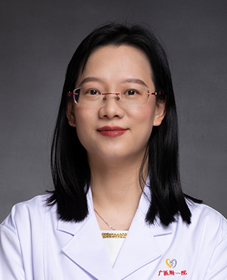

<!-- AUTO-GENERATED-BY: work/generate_obsidian_profiles.py -->

<!-- TEMPLATE: D:\workspace\信息收集整理\医生画像仓库\模板\医生画像模板.md -->

# 蓝岚

## 基础信息

| 字段 | 内容 |
|---|---|
| 姓名 | 蓝岚 |
| 医院 | 广州医科大学附属第一医院 |
| 科室 | 麻醉科 |
| 职称/身份 | 麻醉科副主任 |
| 来源链接 | [官网原文](https://www.gyfyyy.cn/cn/ks/wk/mzk/doctor_651.html) |
| 采集日期 | 2026-08-13 |

## 简介/擅长

心胸麻醉，主要研究方向是肺损伤机制及保护

## 可包装亮点

- 国家规培基地教学主任，医学博士 广州医科大学硕士研究生导师 广州医科大学麻醉系教研室副主任 广州市医师协会麻醉学分会委员会委员 广州市医师协会危重症医师分会常务委员 广东省医学教育协会麻醉学专业委员会委员 广东省抗癌协会肿瘤麻醉及镇痛治疗专业委员会常务委员 广东省基层医药学会第一届麻醉学专业委员会副主委 中国心胸血管麻醉学会胸科麻醉分会委员

## 重点疾病/人群标签

- 慢性病：
- 肿瘤：肿瘤、癌、危重
- 生殖疾病：
- 免疫/风湿：
- 术后恢复/康复：
- 疑难重症：肿瘤、癌、危重

## 证据摘录

> 只摘录官网公开信息中的短句或关键字段，不复制大段原文。

- 官网身份字段：麻醉科副主任
- 官网简介/擅长：心胸麻醉，主要研究方向是肺损伤机制及保护
- 官网亮眼经历线索：国家规培基地教学主任，医学博士 广州医科大学硕士研究生导师 广州医科大学麻醉系教研室副主任 广州市医师协会麻醉学分会委员会委员 广州市医师协会危重症医师分会常务委员 广东省医学教育协会麻醉学专业委员会委员 广东省抗癌协会肿瘤麻醉及镇痛治疗专业委员会常务委员 广东省基层医药学会第一届麻醉学专业委员会副主委 中国心胸血管麻醉学会胸科麻醉分会委员
- 来源链接：https://www.gyfyyy.cn/cn/ks/wk/mzk/doctor_651.html

## BD 画像摘要

蓝岚医生可作为肿瘤、疑难重症方向的基础画像候选。后续 BD 使用应继续以官网来源和人工复核为准，不添加疗效承诺或无来源包装。

## 合规边界

- 仅使用医院官网、官方公众号、官方小程序等公开渠道。
- 不采集私人电话、私人微信、家庭住址、患者隐私或非公开排班信息。
- 不写“保证治愈”“疗效第一”“包治疑难杂症”等无法由官网证明的表述。
