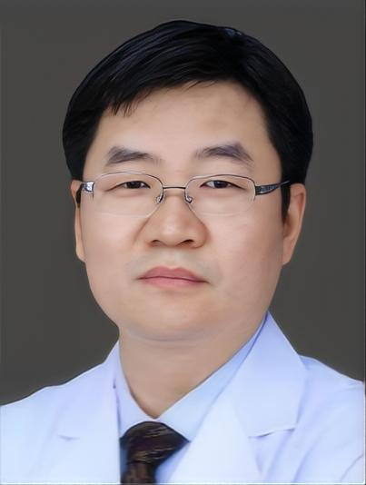

<!-- AUTO-GENERATED-BY: work/generate_obsidian_profiles.py -->

<!-- TEMPLATE: D:\workspace\信息收集整理\医生画像仓库\模板\医生画像模板.md -->

# 薛兴阳

## 基础信息

| 字段 | 内容 |
|---|---|
| 姓名 | 薛兴阳 |
| 医院 | 广州医科大学附属第一医院 |
| 科室 | 胸外科 |
| 职称/身份 | 主任医师 |
| 来源链接 | [官网原文](https://www.gyfyyy.cn/cn/ks/wk/xwk/doctor_805.html) |
| 采集日期 | 2026-08-13 |

## 简介/擅长

1. 肺磨玻璃结节及实性结节良恶性鉴别及微创治疗；2.单发及多发肺结节、肺癌、肺转移瘤、纵隔肿瘤、胸壁肿瘤、胸膜肿瘤等胸部肿瘤CT引导及穿刺机器人辅助经皮穿刺活检，介入消融治疗；3.胸腔镜、介入消融外科为主的胸部肿瘤综合治疗及全生命周期管理。

## 教育与进修经历

- 博士，主任医师，博士研究生导师，广东省杰出青年医学人才，羊城好医生，美国西北大学肿瘤中心访问学者。

## 可包装亮点

- 博士，主任医师，博士研究生导师，广东省杰出青年医学人才，羊城好医生，美国西北大学肿瘤中心访问学者。

## 重点疾病/人群标签

- 慢性病：
- 肿瘤：肿瘤、瘤、肺癌
- 生殖疾病：
- 免疫/风湿：
- 术后恢复/康复：
- 疑难重症：

## 证据摘录

> 只摘录官网公开信息中的短句或关键字段，不复制大段原文。

- 官网身份字段：主任医师
- 官网简介/擅长：1. 肺磨玻璃结节及实性结节良恶性鉴别及微创治疗；2.单发及多发肺结节、肺癌、肺转移瘤、纵隔肿瘤、胸壁肿瘤、胸膜肿瘤等胸部肿瘤CT引导及穿刺机器人辅助经皮穿刺活检，介入消融治疗；3.胸腔镜、介入消融外科为主的胸部肿瘤综合治疗及全生命周期管理。
- 官网亮眼经历线索：博士，主任医师，博士研究生导师，广东省杰出青年医学人才，羊城好医生，美国西北大学肿瘤中心访问学者。
- 来源链接：https://www.gyfyyy.cn/cn/ks/wk/xwk/doctor_805.html

## BD 画像摘要

薛兴阳医生可作为肿瘤方向的基础画像候选。后续 BD 使用应继续以官网来源和人工复核为准，不添加疗效承诺或无来源包装。

## 合规边界

- 仅使用医院官网、官方公众号、官方小程序等公开渠道。
- 不采集私人电话、私人微信、家庭住址、患者隐私或非公开排班信息。
- 不写“保证治愈”“疗效第一”“包治疑难杂症”等无法由官网证明的表述。
