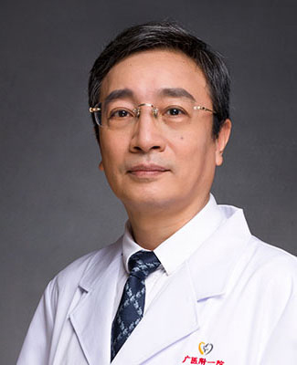

<!-- AUTO-GENERATED-BY: work/generate_obsidian_profiles.py -->

<!-- TEMPLATE: D:\workspace\信息收集整理\医生画像仓库\模板\医生画像模板.md -->

# 谢少波

## 基础信息

| 字段 | 内容 |
|---|---|
| 姓名 | 谢少波 |
| 医院 | 广州医科大学附属第一医院 |
| 科室 | 心脏外科 |
| 职称/身份 | 主任医师 硕士导师 |
| 来源链接 | [官网原文](https://www.gyfyyy.cn/cn/ks/wk/xzwk/doctor_177.html) |
| 采集日期 | 2026-08-13 |

## 简介/擅长

婴幼儿先心病矫治术、复杂先心矫治术、心脏瓣膜置换/整形术、冠脉搭桥术与心脏外科常见及疑难疾病的诊断治疗。

## 科研项目与成果

- 主持参与省市级科研项目 10余项，主持国家级省市级继续教育项目10余项，发表SCI和省级国家级核心期刊 3 0余篇，培养研究生 2 0余名。

## 论文与学术产出

- 主持参与省市级科研项目 10余项，主持国家级省市级继续教育项目10余项，发表SCI和省级国家级核心期刊 3 0余篇，培养研究生 2 0余名。

## 可包装亮点

- 心脏大血管外科学科带头人谢少波，主任医师、教授，硕士生导师。
- 国家心血管病专业质控中心专家委员会外科介入专家，广东省医学会心胸外科分会副主任委员，广东省胸部疾病学会心血管外科分会主委，亚洲心脏瓣膜病学会中国分会委员，中华医学会器官移植学会分会第八届委员会心脏移植学组委员，广东省胸部疾病学会心肺移植专业委员会副主任委员，广东省医师协会心胸外科分会常委，主持开展了婴幼儿先心病矫治术、复杂先心矫治术、儿童气管狭窄滑动成型手…
- 主持参与省市级科研项目 10余项，主持国家级省市级继续教育项目10余项，发表SCI和省级国家级核心期刊 3 0余篇，培养研究生 2 0余名。

## 重点疾病/人群标签

- 慢性病：
- 肿瘤：
- 生殖疾病：
- 免疫/风湿：
- 术后恢复/康复：
- 疑难重症：疑难、复杂

## 证据摘录

> 只摘录官网公开信息中的短句或关键字段，不复制大段原文。

- 官网身份字段：主任医师 硕士导师
- 官网简介/擅长：婴幼儿先心病矫治术、复杂先心矫治术、心脏瓣膜置换/整形术、冠脉搭桥术与心脏外科常见及疑难疾病的诊断治疗。
- 官网亮眼经历线索：心脏大血管外科学科带头人谢少波，主任医师、教授，硕士生导师。 国家心血管病专业质控中心专家委员会外科介入专家，广东省医学会心胸外科分会副主任委员，广东省胸部疾病学会心血管外科分会主委，亚洲心脏瓣膜病学会中国分会委员，中华医学会器官移植学会分会第八届委员会心脏移植学组委员，广东省胸部疾病学会心肺移植专业委员会副主任委员，广东省医师协会心胸外科分会常委，主持开展了婴幼儿先心病矫治术、复杂先心矫治术、儿童气管狭窄滑动成型手术、心脏瓣膜置换…
- 来源链接：https://www.gyfyyy.cn/cn/ks/wk/xzwk/doctor_177.html

## BD 画像摘要

谢少波医生可作为疑难重症方向的基础画像候选。后续 BD 使用应继续以官网来源和人工复核为准，不添加疗效承诺或无来源包装。

## 合规边界

- 仅使用医院官网、官方公众号、官方小程序等公开渠道。
- 不采集私人电话、私人微信、家庭住址、患者隐私或非公开排班信息。
- 不写“保证治愈”“疗效第一”“包治疑难杂症”等无法由官网证明的表述。
