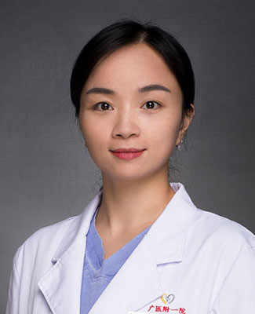

<!-- AUTO-GENERATED-BY: work/generate_obsidian_profiles.py -->

<!-- TEMPLATE: D:\workspace\信息收集整理\医生画像仓库\模板\医生画像模板.md -->

# 谭维格

## 基础信息

| 字段 | 内容 |
|---|---|
| 姓名 | 谭维格 |
| 医院 | 广州医科大学附属第一医院 |
| 科室 | 乳腺外科 |
| 职称/身份 | 副主任医师 |
| 来源链接 | [官网原文](https://www.gyfyyy.cn/cn/ks/wk/rxwk/doctor_411.html) |
| 采集日期 | 2026-08-13 |

## 简介/擅长

乳腺肿瘤的综合治疗，尤其是乳腺癌的外科治疗，包括乳腺癌的保乳手术、前哨淋巴结活检术、改良根治术、淋巴结清扫术、腔镜手术、乳腺肿瘤整形修复及重建手术等。乳房结节和钙化灶的微创精准切除。

## 教育与进修经历

- 毕业与中山大学临床医学专业，外科学博士，乳腺外科博士后。
- 广州医科大学附属第一医院乳腺外科副教授，硕士生导师，全科医师住院医师规范化培训骨干导师。

## 科研项目与成果

- 中国广东省卫生信息网络协会智慧乳腺分会 副会长 中国老年保健协会乳腺专业委员会 委员 广东省胸部肿瘤防治研究会乳腺肿瘤内科专业委员会 常委 广东省精准医学应用学会乳腺肿瘤分会 常委 广东省老年保健协会乳腺整合治疗专委会 常委 广东省医疗行业协会乳腺专科管理分会 常委 广东省医师协会乳腺乳腺专科医师分会青年学组 委员 广东省基层医药学会乳腺微创重建专业委员会 委员 广州市医师协会乳腺病分会 委员 获国家自然科学基金，广东省自然科学基金、广州市科技计划项目、广州医科大学附属第一医院国家级培育项目等多项科研基金资助。

## 可包装亮点

- 乳房结节和钙化灶的微创精准切除。
- 广州医科大学附属第一医院乳腺外科副教授，硕士生导师，全科医师住院医师规范化培训骨干导师。
- 第九届“羊城好医生”。
- 中国广东省卫生信息网络协会智慧乳腺分会 副会长 中国老年保健协会乳腺专业委员会 委员 广东省胸部肿瘤防治研究会乳腺肿瘤内科专业委员会 常委 广东省精准医学应用学会乳腺肿瘤分会 常委 广东省老年保健协会乳腺整合治疗专委会 常委 广东省医疗行业协会乳腺专科管理分会 常委 广东省医师协会乳腺乳腺专科医师分会青年学组 委员 广东省基层医药学会乳腺微创重建专业委员会…

## 重点疾病/人群标签

- 慢性病：
- 肿瘤：肿瘤、乳腺癌
- 生殖疾病：
- 免疫/风湿：
- 术后恢复/康复：
- 疑难重症：

## 证据摘录

> 只摘录官网公开信息中的短句或关键字段，不复制大段原文。

- 官网身份字段：副主任医师
- 官网简介/擅长：乳腺肿瘤的综合治疗，尤其是乳腺癌的外科治疗，包括乳腺癌的保乳手术、前哨淋巴结活检术、改良根治术、淋巴结清扫术、腔镜手术、乳腺肿瘤整形修复及重建手术等。乳房结节和钙化灶的微创精准切除。
- 官网亮眼经历线索：乳房结节和钙化灶的微创精准切除。 广州医科大学附属第一医院乳腺外科副教授，硕士生导师，全科医师住院医师规范化培训骨干导师。 第九届“羊城好医生”。 中国广东省卫生信息网络协会智慧乳腺分会 副会长 中国老年保健协会乳腺专业委员会 委员 广东省胸部肿瘤防治研究会乳腺肿瘤内科专业委员会 常委 广东省精准医学应用学会乳腺肿瘤分会 常委 广东省老年保健协会乳腺整合治疗专委会 常委 广东省医疗行业协会乳腺专科管理分会 常委 广东省医师协会乳腺乳腺…
- 来源链接：https://www.gyfyyy.cn/cn/ks/wk/rxwk/doctor_411.html

## BD 画像摘要

谭维格医生可作为肿瘤方向的基础画像候选。后续 BD 使用应继续以官网来源和人工复核为准，不添加疗效承诺或无来源包装。

## 合规边界

- 仅使用医院官网、官方公众号、官方小程序等公开渠道。
- 不采集私人电话、私人微信、家庭住址、患者隐私或非公开排班信息。
- 不写“保证治愈”“疗效第一”“包治疑难杂症”等无法由官网证明的表述。
