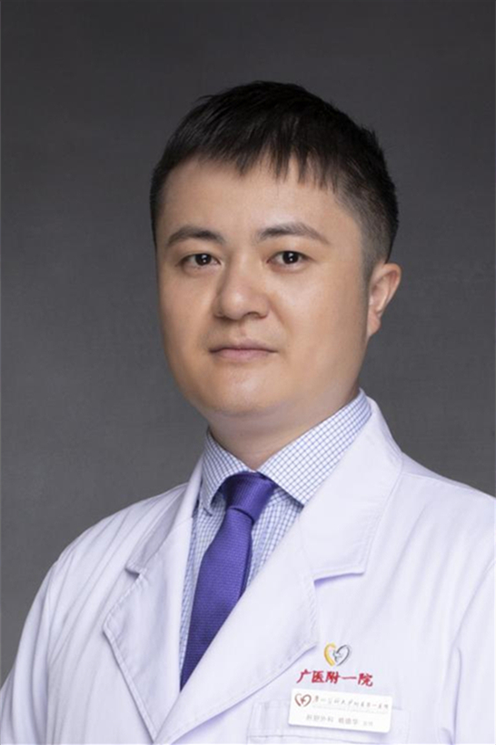

<!-- AUTO-GENERATED-BY: work/generate_obsidian_profiles.py -->

<!-- TEMPLATE: D:\workspace\信息收集整理\医生画像仓库\模板\医生画像模板.md -->

# 赖德华

## 基础信息

| 字段 | 内容 |
|---|---|
| 姓名 | 赖德华 |
| 医院 | 广州医科大学附属第一医院 |
| 科室 | 肝胆外科 |
| 职称/身份 | 主治医师 |
| 来源链接 | [官网原文](https://www.gyfyyy.cn/cn/ks/wk/gdwk/doctor_816.html) |
| 采集日期 | 2026-08-13 |

## 简介/擅长

对肝胆良性疾病如结石、息肉，肝胆脾胰良、恶性肿瘤，胃肠、甲状腺、疝气、痔疮等普通外科疾病有丰富的临床经验。擅长腹腔镜、胆道镜、微创消融等微创技术，尤其对复杂胆道结石、胆道狭窄的微创胆道镜治疗处于国内领先水平。

## 教育与进修经历

- 职称:主治医师 教育经历:广州医科大学研究生毕业，获得医学硕士学位

## 可包装亮点

- 对肝胆良性疾病如结石、息肉，肝胆脾胰良、恶性肿瘤，胃肠、甲状腺、疝气、痔疮等普通外科疾病有丰富的临床经验。
- 擅长腹腔镜、胆道镜、微创消融等微创技术，尤其对复杂胆道结石、胆道狭窄的微创胆道镜治疗处于国内领先水平。

## 重点疾病/人群标签

- 慢性病：
- 肿瘤：肿瘤、复杂
- 生殖疾病：
- 免疫/风湿：
- 术后恢复/康复：
- 疑难重症：肿瘤、复杂

## 证据摘录

> 只摘录官网公开信息中的短句或关键字段，不复制大段原文。

- 官网身份字段：主治医师
- 官网简介/擅长：对肝胆良性疾病如结石、息肉，肝胆脾胰良、恶性肿瘤，胃肠、甲状腺、疝气、痔疮等普通外科疾病有丰富的临床经验。擅长腹腔镜、胆道镜、微创消融等微创技术，尤其对复杂胆道结石、胆道狭窄的微创胆道镜治疗处于国内领先水平。
- 来源链接：https://www.gyfyyy.cn/cn/ks/wk/gdwk/doctor_816.html

## BD 画像摘要

赖德华医生可作为肿瘤、疑难重症方向的基础画像候选。后续 BD 使用应继续以官网来源和人工复核为准，不添加疗效承诺或无来源包装。

## 合规边界

- 仅使用医院官网、官方公众号、官方小程序等公开渠道。
- 不采集私人电话、私人微信、家庭住址、患者隐私或非公开排班信息。
- 不写“保证治愈”“疗效第一”“包治疑难杂症”等无法由官网证明的表述。
