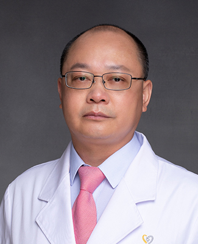

<!-- AUTO-GENERATED-BY: work/generate_obsidian_profiles.py -->

<!-- TEMPLATE: D:\workspace\信息收集整理\医生画像仓库\模板\医生画像模板.md -->

# 赖荣德

## 基础信息

| 字段 | 内容 |
|---|---|
| 姓名 | 赖荣德 |
| 医院 | 广州医科大学附属第一医院 |
| 科室 | 急诊科 |
| 职称/身份 | 蛇伤救治组组长，主任医师 急诊医学硕士研究生导师 |
| 来源链接 | [官网原文](https://www.gyfyyy.cn/cn/ks/jzk/doctor_460.html) |
| 采集日期 | 2026-08-13 |

## 简介/擅长

毒蛇咬伤救治、危重症及呼吸急症等。

## 科研项目与成果

- 主编《危重急症识别与处置》、《急诊科医师诊疗思维与决策》，参编专著多部，主持完成省市级课题各一项，发表学术论文30余篇。

## 论文与学术产出

- 主编《危重急症识别与处置》、《急诊科医师诊疗思维与决策》，参编专著多部，主持完成省市级课题各一项，发表学术论文30余篇。

## 可包装亮点

- 急诊科主任医师，硕士研究生导师，蛇伤救治组组长，《2018年中国蛇伤救治专家共识》执笔人/通讯作者，广东省中西医结合学会蛇伤急救专业委员会常委/秘书、广东省精准医学应用学会毒物与中毒分会常委、中国研究型医院学会卫生应急学专业委员会委员。
- 主编《危重急症识别与处置》、《急诊科医师诊疗思维与决策》，参编专著多部，主持完成省市级课题各一项，发表学术论文30余篇。

## 重点疾病/人群标签

- 慢性病：
- 肿瘤：
- 生殖疾病：
- 免疫/风湿：
- 术后恢复/康复：
- 疑难重症：危重

## 证据摘录

> 只摘录官网公开信息中的短句或关键字段，不复制大段原文。

- 官网身份字段：蛇伤救治组组长，主任医师 急诊医学硕士研究生导师
- 官网简介/擅长：毒蛇咬伤救治、危重症及呼吸急症等。
- 官网亮眼经历线索：急诊科主任医师，硕士研究生导师，蛇伤救治组组长，《2018年中国蛇伤救治专家共识》执笔人/通讯作者，广东省中西医结合学会蛇伤急救专业委员会常委/秘书、广东省精准医学应用学会毒物与中毒分会常委、中国研究型医院学会卫生应急学专业委员会委员。 主编《危重急症识别与处置》、《急诊科医师诊疗思维与决策》，参编专著多部，主持完成省市级课题各一项，发表学术论文30余篇。
- 来源链接：https://www.gyfyyy.cn/cn/ks/jzk/doctor_460.html

## BD 画像摘要

赖荣德医生可作为疑难重症方向的基础画像候选。后续 BD 使用应继续以官网来源和人工复核为准，不添加疗效承诺或无来源包装。

## 合规边界

- 仅使用医院官网、官方公众号、官方小程序等公开渠道。
- 不采集私人电话、私人微信、家庭住址、患者隐私或非公开排班信息。
- 不写“保证治愈”“疗效第一”“包治疑难杂症”等无法由官网证明的表述。
