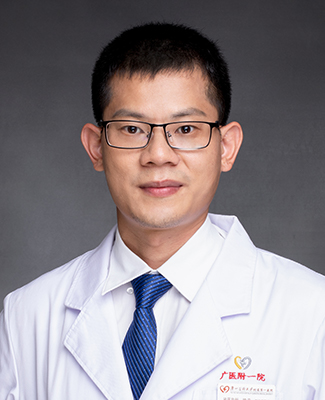

<!-- AUTO-GENERATED-BY: work/generate_obsidian_profiles.py -->

<!-- TEMPLATE: D:\workspace\信息收集整理\医生画像仓库\模板\医生画像模板.md -->

# 钟文

## 基础信息

| 字段 | 内容 |
|---|---|
| 姓名 | 钟文 |
| 医院 | 广州医科大学附属第一医院 |
| 科室 | 泌尿外科 |
| 职称/身份 | 泌尿外科副主任，主任医师 |
| 来源链接 | [官网原文](https://www.gyfyyy.cn/cn/ks/wk/bnwk/doctor_428.html) |
| 采集日期 | 2026-08-13 |

## 简介/擅长

微创技术治疗尿路结石、输尿管狭窄、前列腺增生等。特别是经皮肾、软镜等治疗鹿角状结石，孤立肾、马蹄肾、移植肾等复杂病例合并结石，以及各种输尿管狭窄、肾积水。

## 教育与进修经历

- 医生介绍： 医学博士， 美国 UTH 留学 博士后 ，博士 研究生导师；

## 科研项目与成果

- 从事临床与科研工作十余年，主持国家自然科学基金重点项目子项目、面上项目以及青年项目、省自然科学基金面上项目等十余项科研项目，获广东省科技进步一等奖。

## 可包装亮点

- 医生介绍： 医学博士， 美国 UTH 留学 博士后 ，博士 研究生导师；
- 广东省杰出青年医学人才，广州市高层次人才，珠江科技新星 ；
- CUA 微创学组委员， CUDA 结石学组委员，广东省医学会泌尿外科分会结石学组委员。
- 从事临床与科研工作十余年，主持国家自然科学基金重点项目子项目、面上项目以及青年项目、省自然科学基金面上项目等十余项科研项目，获广东省科技进步一等奖。

## 重点疾病/人群标签

- 慢性病：
- 肿瘤：
- 生殖疾病：
- 免疫/风湿：
- 术后恢复/康复：
- 疑难重症：复杂

## 证据摘录

> 只摘录官网公开信息中的短句或关键字段，不复制大段原文。

- 官网身份字段：泌尿外科副主任，主任医师
- 官网简介/擅长：微创技术治疗尿路结石、输尿管狭窄、前列腺增生等。特别是经皮肾、软镜等治疗鹿角状结石，孤立肾、马蹄肾、移植肾等复杂病例合并结石，以及各种输尿管狭窄、肾积水。
- 官网亮眼经历线索：医生介绍： 医学博士， 美国 UTH 留学 博士后 ，博士 研究生导师； 广东省杰出青年医学人才，广州市高层次人才，珠江科技新星 ； CUA 微创学组委员， CUDA 结石学组委员，广东省医学会泌尿外科分会结石学组委员。 从事临床与科研工作十余年，主持国家自然科学基金重点项目子项目、面上项目以及青年项目、省自然科学基金面上项目等十余项科研项目，获广东省科技进步一等奖。
- 来源链接：https://www.gyfyyy.cn/cn/ks/wk/bnwk/doctor_428.html

## BD 画像摘要

钟文医生可作为疑难重症方向的基础画像候选。后续 BD 使用应继续以官网来源和人工复核为准，不添加疗效承诺或无来源包装。

## 合规边界

- 仅使用医院官网、官方公众号、官方小程序等公开渠道。
- 不采集私人电话、私人微信、家庭住址、患者隐私或非公开排班信息。
- 不写“保证治愈”“疗效第一”“包治疑难杂症”等无法由官网证明的表述。
