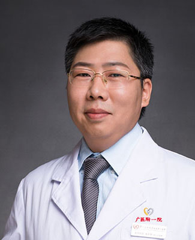

<!-- AUTO-GENERATED-BY: work/generate_obsidian_profiles.py -->

<!-- TEMPLATE: D:\workspace\信息收集整理\医生画像仓库\模板\医生画像模板.md -->

# 钱东阳

## 基础信息

| 字段 | 内容 |
|---|---|
| 姓名 | 钱东阳 |
| 医院 | 广州医科大学附属第一医院 |
| 科室 | 关节外科 |
| 职称/身份 | 骨肿瘤科主任，关节外科行政副主任，主任医师 硕士研究生导师 |
| 来源链接 | [官网原文](https://www.gyfyyy.cn/cn/ks/wk/gjwk/doctor_288.html) |
| 采集日期 | 2026-08-13 |

## 简介/擅长

髋膝关节疾病（骨性关节炎、先天髋、股骨头坏死、类风湿性关节炎等）的保髋、保膝及微创人工关节置换、翻修手术，擅长微创肩、膝关节镜手术，骨折微创治疗及骨肿瘤的外科治疗。

## 教育与进修经历

- 从事骨科专业 1 5 余年， 2007年广州医科大学硕士毕业后留在广州医科大学附属第一医院工作至今，201 7 年获得南方医科大学博士学位， 2019年1月至2020年9月在哈佛医学院附属布莱根妇女医院进行博士后研究，从事骨代谢及骨缺损修复的基础研究及骨关节修复重建的临床研究工作。

## 科研项目与成果

- 主持并参与多项国家、省市级科研项目，发表 SCI及国内核心期刊论文20余篇。

## 论文与学术产出

- 主持并参与多项国家、省市级科研项目，发表 SCI及国内核心期刊论文20余篇。

## 可包装亮点

- 现任中国康复医学会广东省修复重建外科学会副主任委员，中国中西医结合学会实验医学专业委员会委员，广东省临床医学会风湿免疫专业委员会常委，广东省关节外科分会青年委员，广州市医师协会骨科医师分会委员兼秘书，中华关节外科杂志（电子版）通讯编委。
- 主持并参与多项国家、省市级科研项目，发表 SCI及国内核心期刊论文20余篇。

## 重点疾病/人群标签

- 慢性病：代谢、肿瘤、风湿、免疫、类风湿、康复
- 肿瘤：代谢、肿瘤、风湿、免疫、类风湿、康复
- 生殖疾病：
- 免疫/风湿：代谢、肿瘤、风湿、免疫、类风湿、康复
- 术后恢复/康复：代谢、肿瘤、风湿、免疫、类风湿、康复
- 疑难重症：

## 证据摘录

> 只摘录官网公开信息中的短句或关键字段，不复制大段原文。

- 官网身份字段：骨肿瘤科主任，关节外科行政副主任，主任医师 硕士研究生导师
- 官网简介/擅长：髋膝关节疾病（骨性关节炎、先天髋、股骨头坏死、类风湿性关节炎等）的保髋、保膝及微创人工关节置换、翻修手术，擅长微创肩、膝关节镜手术，骨折微创治疗及骨肿瘤的外科治疗。
- 官网亮眼经历线索：现任中国康复医学会广东省修复重建外科学会副主任委员，中国中西医结合学会实验医学专业委员会委员，广东省临床医学会风湿免疫专业委员会常委，广东省关节外科分会青年委员，广州市医师协会骨科医师分会委员兼秘书，中华关节外科杂志（电子版）通讯编委。 主持并参与多项国家、省市级科研项目，发表 SCI及国内核心期刊论文20余篇。
- 来源链接：https://www.gyfyyy.cn/cn/ks/wk/gjwk/doctor_288.html

## BD 画像摘要

钱东阳医生可作为慢性病、肿瘤、免疫/风湿/感染、术后恢复/康复方向的基础画像候选。后续 BD 使用应继续以官网来源和人工复核为准，不添加疗效承诺或无来源包装。

## 合规边界

- 仅使用医院官网、官方公众号、官方小程序等公开渠道。
- 不采集私人电话、私人微信、家庭住址、患者隐私或非公开排班信息。
- 不写“保证治愈”“疗效第一”“包治疑难杂症”等无法由官网证明的表述。
