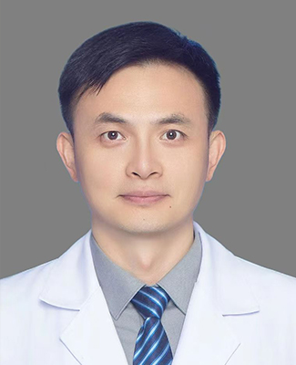

<!-- AUTO-GENERATED-BY: work/generate_obsidian_profiles.py -->

<!-- TEMPLATE: D:\workspace\信息收集整理\医生画像仓库\模板\医生画像模板.md -->

# 陈刚

## 基础信息

| 字段 | 内容 |
|---|---|
| 姓名 | 陈刚 |
| 医院 | 广州医科大学附属第一医院 |
| 科室 | 神经外科 |
| 职称/身份 | 主任医师 |
| 来源链接 | [官网原文](https://www.gyfyyy.cn/cn/ks/wk/sjwk/doctor_759.html) |
| 采集日期 | 2026-08-13 |

## 简介/擅长

脑膜瘤、胶质瘤、垂体瘤、听神经瘤等各种颅脑肿瘤的显微手术；脊柱脊髓肿瘤及退行性疾病；烟雾病联合搭桥；颈动脉斑块狭窄内膜剥脱术。

## 教育与进修经历

- 简介：夏成雨--神经外科专家团队骨干成员，2006年山东大学临床医学本硕连读毕业，2013上海华山医院神经外科学习神经肿瘤及神经重症，2016北京宣武医院脊柱神经外科学习脊柱脊髓肿瘤及退变疾病。

## 可包装亮点

- 主任医师 擅长：脑膜瘤、胶质瘤、垂体瘤、听神经瘤等各种颅脑肿瘤的显微手术；

## 重点疾病/人群标签

- 慢性病：
- 肿瘤：肿瘤、瘤、重症
- 生殖疾病：
- 免疫/风湿：
- 术后恢复/康复：
- 疑难重症：肿瘤、瘤、重症

## 证据摘录

> 只摘录官网公开信息中的短句或关键字段，不复制大段原文。

- 官网身份字段：主任医师
- 官网简介/擅长：脑膜瘤、胶质瘤、垂体瘤、听神经瘤等各种颅脑肿瘤的显微手术；脊柱脊髓肿瘤及退行性疾病；烟雾病联合搭桥；颈动脉斑块狭窄内膜剥脱术。
- 官网亮眼经历线索：主任医师 擅长：脑膜瘤、胶质瘤、垂体瘤、听神经瘤等各种颅脑肿瘤的显微手术；
- 来源链接：https://www.gyfyyy.cn/cn/ks/wk/sjwk/doctor_759.html

## BD 画像摘要

陈刚医生可作为肿瘤、疑难重症方向的基础画像候选。后续 BD 使用应继续以官网来源和人工复核为准，不添加疗效承诺或无来源包装。

## 合规边界

- 仅使用医院官网、官方公众号、官方小程序等公开渠道。
- 不采集私人电话、私人微信、家庭住址、患者隐私或非公开排班信息。
- 不写“保证治愈”“疗效第一”“包治疑难杂症”等无法由官网证明的表述。
