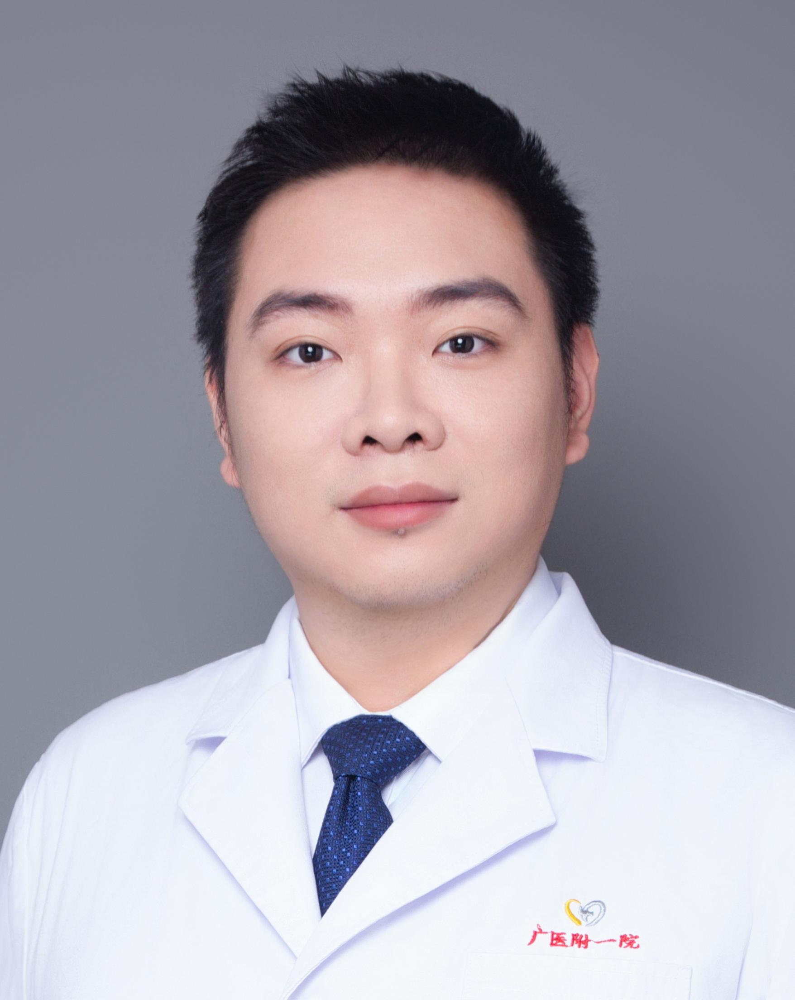

<!-- AUTO-GENERATED-BY: work/generate_obsidian_profiles.py -->

<!-- TEMPLATE: D:\workspace\信息收集整理\医生画像仓库\模板\医生画像模板.md -->

# 陈宇璠

## 基础信息

| 字段 | 内容 |
|---|---|
| 姓名 | 陈宇璠 |
| 医院 | 广州医科大学附属第一医院 |
| 科室 | 关节外科 |
| 职称/身份 | 主治医师 |
| 来源链接 | [官网原文](https://www.gyfyyy.cn/cn/ks/wk/gjwk/doctor_862.html) |
| 采集日期 | 2026-08-13 |

## 简介/擅长

骨与关节慢性疾病，肢体复杂骨与关节骨折，肢体创伤及慢性创面修复重建、骨折各种后遗症与骨不连、骨缺损、畸形愈合及运动损伤的治疗。

## 科研项目与成果

- 在国内外学术期刊上发表学术论文十余篇，其中与美国康奈尔大学合作在nature communication发表论文一篇，并曾参与NIH、国自然等多个基金项目研究。

## 论文与学术产出

- 在国内外学术期刊上发表学术论文十余篇，其中与美国康奈尔大学合作在nature communication发表论文一篇，并曾参与NIH、国自然等多个基金项目研究。

## 可包装亮点

- 在国内外学术期刊上发表学术论文十余篇，其中与美国康奈尔大学合作在nature communication发表论文一篇，并曾参与NIH、国自然等多个基金项目研究。

## 重点疾病/人群标签

- 慢性病：慢性、创面、复杂
- 肿瘤：
- 生殖疾病：
- 免疫/风湿：
- 术后恢复/康复：慢性、创面、复杂
- 疑难重症：慢性、创面、复杂

## 证据摘录

> 只摘录官网公开信息中的短句或关键字段，不复制大段原文。

- 官网身份字段：主治医师
- 官网简介/擅长：骨与关节慢性疾病，肢体复杂骨与关节骨折，肢体创伤及慢性创面修复重建、骨折各种后遗症与骨不连、骨缺损、畸形愈合及运动损伤的治疗。
- 官网亮眼经历线索：在国内外学术期刊上发表学术论文十余篇，其中与美国康奈尔大学合作在nature communication发表论文一篇，并曾参与NIH、国自然等多个基金项目研究。
- 来源链接：https://www.gyfyyy.cn/cn/ks/wk/gjwk/doctor_862.html

## BD 画像摘要

陈宇璠医生可作为慢性病、术后恢复/康复、疑难重症方向的基础画像候选。后续 BD 使用应继续以官网来源和人工复核为准，不添加疗效承诺或无来源包装。

## 合规边界

- 仅使用医院官网、官方公众号、官方小程序等公开渠道。
- 不采集私人电话、私人微信、家庭住址、患者隐私或非公开排班信息。
- 不写“保证治愈”“疗效第一”“包治疑难杂症”等无法由官网证明的表述。
