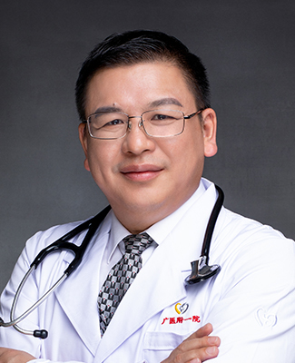

<!-- AUTO-GENERATED-BY: work/generate_obsidian_profiles.py -->

<!-- TEMPLATE: D:\workspace\信息收集整理\医生画像仓库\模板\医生画像模板.md -->

# 高兴成

## 基础信息

| 字段 | 内容 |
|---|---|
| 姓名 | 高兴成 |
| 医院 | 广州医科大学附属第一医院 |
| 科室 | 泌尿外科 |
| 职称/身份 | 主任医师 硕士导师 |
| 来源链接 | [官网原文](https://www.gyfyyy.cn/cn/ks/wk/bnwk/doctor_546.html) |
| 采集日期 | 2026-08-13 |

## 简介/擅长

微创泌尿外科和男性生殖（不育）相关疾病的诊治

## 教育与进修经历

- 毕业于华中科技大学同济医学院，泌尿外科工作近30年。

## 可包装亮点

- 中国医师协会男科学分会委员，中华医学会男科学分会男性不育学组委员，广东省医学会男科学分会常委/生殖学组组长、广东省医师协会泌尿外科学分会常委、广东省健康管理学会男性健康专业委员会副主任委员，省优生优育协会专家委员会副主任委员、广州市男科学分会主任委员、微创泌尿外科分会副主任委员等。

## 重点疾病/人群标签

- 慢性病：
- 肿瘤：
- 生殖疾病：生殖
- 免疫/风湿：
- 术后恢复/康复：
- 疑难重症：

## 证据摘录

> 只摘录官网公开信息中的短句或关键字段，不复制大段原文。

- 官网身份字段：主任医师 硕士导师
- 官网简介/擅长：微创泌尿外科和男性生殖（不育）相关疾病的诊治
- 官网亮眼经历线索：中国医师协会男科学分会委员，中华医学会男科学分会男性不育学组委员，广东省医学会男科学分会常委/生殖学组组长、广东省医师协会泌尿外科学分会常委、广东省健康管理学会男性健康专业委员会副主任委员，省优生优育协会专家委员会副主任委员、广州市男科学分会主任委员、微创泌尿外科分会副主任委员等。
- 来源链接：https://www.gyfyyy.cn/cn/ks/wk/bnwk/doctor_546.html

## BD 画像摘要

高兴成医生可作为生殖疾病方向的基础画像候选。后续 BD 使用应继续以官网来源和人工复核为准，不添加疗效承诺或无来源包装。

## 合规边界

- 仅使用医院官网、官方公众号、官方小程序等公开渠道。
- 不采集私人电话、私人微信、家庭住址、患者隐私或非公开排班信息。
- 不写“保证治愈”“疗效第一”“包治疑难杂症”等无法由官网证明的表述。
