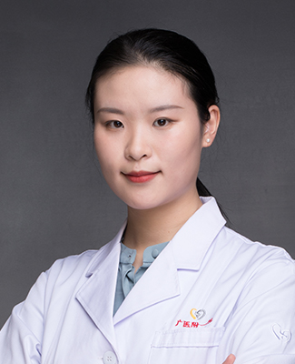

<!-- AUTO-GENERATED-BY: work/generate_obsidian_profiles.py -->

<!-- TEMPLATE: D:\workspace\信息收集整理\医生画像仓库\模板\医生画像模板.md -->

# 高鹭

## 基础信息

| 字段 | 内容 |
|---|---|
| 姓名 | 高鹭 |
| 医院 | 广州医科大学附属第一医院 |
| 科室 | 眼科 |
| 职称/身份 | 医师 |
| 来源链接 | [官网原文](https://www.gyfyyy.cn/cn/ks/qtzk/yk/doctor_630.html) |
| 采集日期 | 2026-08-13 |

## 简介/擅长

糖尿病视网膜病变等眼底病、白内障、眼外伤等

## 教育与进修经历

- 留美归国人员，中南大学湘雅医学院临床医学八年制博士毕业，美国密歇根大学Kellogg眼科中心联合培养博士。

## 可包装亮点

- 留美归国人员，中南大学湘雅医学院临床医学八年制博士毕业，美国密歇根大学Kellogg眼科中心联合培养博士。
- 熟练掌握眼科各类疾病诊断，对于糖尿病性视网膜病变等眼科疑难危重病的诊断治疗方面能力突出。

## 重点疾病/人群标签

- 慢性病：糖尿病、疑难、危重
- 肿瘤：
- 生殖疾病：
- 免疫/风湿：
- 术后恢复/康复：
- 疑难重症：糖尿病、疑难、危重

## 证据摘录

> 只摘录官网公开信息中的短句或关键字段，不复制大段原文。

- 官网身份字段：医师
- 官网简介/擅长：糖尿病视网膜病变等眼底病、白内障、眼外伤等
- 官网亮眼经历线索：留美归国人员，中南大学湘雅医学院临床医学八年制博士毕业，美国密歇根大学Kellogg眼科中心联合培养博士。 熟练掌握眼科各类疾病诊断，对于糖尿病性视网膜病变等眼科疑难危重病的诊断治疗方面能力突出。
- 来源链接：https://www.gyfyyy.cn/cn/ks/qtzk/yk/doctor_630.html

## BD 画像摘要

高鹭医生可作为慢性病、疑难重症方向的基础画像候选。后续 BD 使用应继续以官网来源和人工复核为准，不添加疗效承诺或无来源包装。

## 合规边界

- 仅使用医院官网、官方公众号、官方小程序等公开渠道。
- 不采集私人电话、私人微信、家庭住址、患者隐私或非公开排班信息。
- 不写“保证治愈”“疗效第一”“包治疑难杂症”等无法由官网证明的表述。
