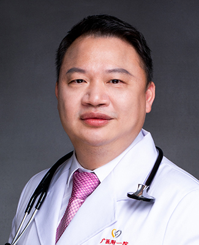

<!-- AUTO-GENERATED-BY: work/generate_obsidian_profiles.py -->

<!-- TEMPLATE: D:\workspace\信息收集整理\医生画像仓库\模板\医生画像模板.md -->

# 黄伟青

## 基础信息

| 字段 | 内容 |
|---|---|
| 姓名 | 黄伟青 |
| 医院 | 广州医科大学附属第一医院 |
| 科室 | 急诊科 |
| 职称/身份 | 教授 急诊医学主任医师 博士生导师 |
| 来源链接 | [官网原文](https://www.gyfyyy.cn/cn/ks/jzk/doctor_247.html) |
| 采集日期 | 2026-08-13 |

## 简介/擅长

内科急危重症的诊疗、中毒、毒蛇咬伤的临床救治。

## 科研项目与成果

- 承担或参与国家级、省部级科研项目多项，发表科研论文20多篇，主编著作4部。
- 获广东省、广州市科技成果三等奖各一项。

## 论文与学术产出

- 承担或参与国家级、省部级科研项目多项，发表科研论文20多篇，主编著作4部。

## 可包装亮点

- 急诊医学教授，主任医师，博士生导师，国家呼吸医学中心副主任，紧密型医联体番禺市桥医院执行院长及急危重症科学科带头人。
- 广州市医师协会全科与基层医师分会主委，广东省医师协会人文医学工作委员会主委，广东省医学会医事法学分会副主委，广州市医学会青年学术委员会副主委，广州市医学会急诊医学分会委员，中国中西医结合学会灾难医学青年委员。
- 承担或参与国家级、省部级科研项目多项，发表科研论文20多篇，主编著作4部。
- 获广东省、广州市科技成果三等奖各一项。

## 重点疾病/人群标签

- 慢性病：
- 肿瘤：
- 生殖疾病：
- 免疫/风湿：
- 术后恢复/康复：
- 疑难重症：急危重

## 证据摘录

> 只摘录官网公开信息中的短句或关键字段，不复制大段原文。

- 官网身份字段：教授 急诊医学主任医师 博士生导师
- 官网简介/擅长：内科急危重症的诊疗、中毒、毒蛇咬伤的临床救治。
- 官网亮眼经历线索：急诊医学教授，主任医师，博士生导师，国家呼吸医学中心副主任，紧密型医联体番禺市桥医院执行院长及急危重症科学科带头人。 广州市医师协会全科与基层医师分会主委，广东省医师协会人文医学工作委员会主委，广东省医学会医事法学分会副主委，广州市医学会青年学术委员会副主委，广州市医学会急诊医学分会委员，中国中西医结合学会灾难医学青年委员。 承担或参与国家级、省部级科研项目多项，发表科研论文20多篇，主编著作4部。 获广东省、广州市科技成果三等奖各一…
- 来源链接：https://www.gyfyyy.cn/cn/ks/jzk/doctor_247.html

## BD 画像摘要

黄伟青医生可作为疑难重症方向的基础画像候选。后续 BD 使用应继续以官网来源和人工复核为准，不添加疗效承诺或无来源包装。

## 合规边界

- 仅使用医院官网、官方公众号、官方小程序等公开渠道。
- 不采集私人电话、私人微信、家庭住址、患者隐私或非公开排班信息。
- 不写“保证治愈”“疗效第一”“包治疑难杂症”等无法由官网证明的表述。
