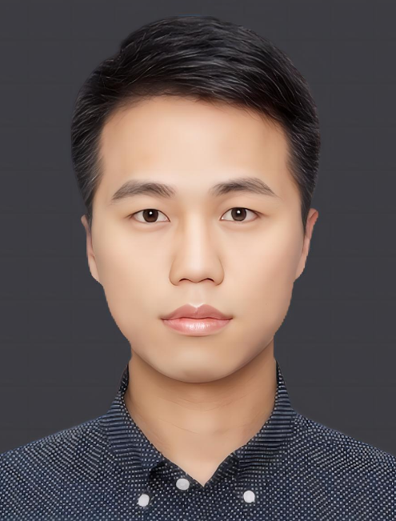

<!-- AUTO-GENERATED-BY: work/generate_obsidian_profiles.py -->

<!-- TEMPLATE: D:\workspace\信息收集整理\医生画像仓库\模板\医生画像模板.md -->

# 黄晓东

## 基础信息

| 字段 | 内容 |
|---|---|
| 姓名 | 黄晓东 |
| 医院 | 广州医科大学附属第一医院 |
| 科室 | 脊柱外科 |
| 职称/身份 | 主治医师 |
| 来源链接 | [官网原文](https://www.gyfyyy.cn/cn/ks/wk/jzwk/doctor_852.html) |
| 采集日期 | 2026-08-13 |

## 简介/擅长

熟练掌握脊柱外科常见病及多发病的诊疗规范。微创手术治疗：腰椎退行性疾病（腰椎间盘突出症、腰椎管狭窄症以及腰椎滑脱等）；脊柱骨折（椎体压缩性骨折等）；颈椎退行性疾病（颈椎病以及颈椎后纵韧带骨化等）；脊柱侧弯）。

## 教育与进修经历

- 职称:主治医师 教育经历:海军军医大学博士研究生毕业，获得医学博士学位 美国辛辛那提大学联合培养博士，美国特种外科医院访问学者，美国哥伦比亚大学Allen医院访问学者。

## 可包装亮点

- 职称:主治医师 教育经历:海军军医大学博士研究生毕业，获得医学博士学位 美国辛辛那提大学联合培养博士，美国特种外科医院访问学者，美国哥伦比亚大学Allen医院访问学者。

## 重点疾病/人群标签

- 慢性病：
- 肿瘤：
- 生殖疾病：
- 免疫/风湿：
- 术后恢复/康复：
- 疑难重症：

## 证据摘录

> 只摘录官网公开信息中的短句或关键字段，不复制大段原文。

- 官网身份字段：主治医师
- 官网简介/擅长：熟练掌握脊柱外科常见病及多发病的诊疗规范。微创手术治疗：腰椎退行性疾病（腰椎间盘突出症、腰椎管狭窄症以及腰椎滑脱等）；脊柱骨折（椎体压缩性骨折等）；颈椎退行性疾病（颈椎病以及颈椎后纵韧带骨化等）；脊柱侧弯）。
- 官网亮眼经历线索：职称:主治医师 教育经历:海军军医大学博士研究生毕业，获得医学博士学位 美国辛辛那提大学联合培养博士，美国特种外科医院访问学者，美国哥伦比亚大学Allen医院访问学者。
- 来源链接：https://www.gyfyyy.cn/cn/ks/wk/jzwk/doctor_852.html

## BD 画像摘要

黄晓东医生可作为广州医科大学附属第一医院脊柱外科的基础医生资料入库。当前重点方向以总底表标签为准，官网未展示的信息保持空白。

## 合规边界

- 仅使用医院官网、官方公众号、官方小程序等公开渠道。
- 不采集私人电话、私人微信、家庭住址、患者隐私或非公开排班信息。
- 不写“保证治愈”“疗效第一”“包治疑难杂症”等无法由官网证明的表述。
