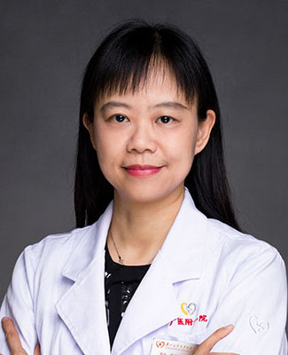

<!-- AUTO-GENERATED-BY: work/generate_obsidian_profiles.py -->

<!-- TEMPLATE: D:\workspace\信息收集整理\医生画像仓库\模板\医生画像模板.md -->

# 黎健菁

## 基础信息

| 字段 | 内容 |
|---|---|
| 姓名 | 黎健菁 |
| 医院 | 广州医科大学附属第一医院 |
| 科室 | 眼科 |
| 职称/身份 | 主任医师 |
| 来源链接 | [官网原文](https://www.gyfyyy.cn/cn/ks/qtzk/yk/doctor_254.html) |
| 采集日期 | 2026-08-13 |

## 简介/擅长

白内障诊断及手术治疗、干眼症等眼表疾病、玻璃体视网膜疾病、青光眼的诊断及治疗。

## 教育与进修经历

- 美国眼表疾病研究及教育基金会及眼表研究中心（OSREF,OSC）访问学者。

## 科研项目与成果

- 美国眼表疾病研究及教育基金会及眼表研究中心（OSREF,OSC）访问学者。

## 可包装亮点

- 美国眼表疾病研究及教育基金会及眼表研究中心（OSREF,OSC）访问学者。
- 广东省眼健康协会与全身病专业委员会及影像专委会常务委员；
- 中国女医师协会会员；
- 广东省女医师协会眼科专委会委员；

## 重点疾病/人群标签

- 慢性病：
- 肿瘤：
- 生殖疾病：
- 免疫/风湿：
- 术后恢复/康复：
- 疑难重症：

## 证据摘录

> 只摘录官网公开信息中的短句或关键字段，不复制大段原文。

- 官网身份字段：主任医师
- 官网简介/擅长：白内障诊断及手术治疗、干眼症等眼表疾病、玻璃体视网膜疾病、青光眼的诊断及治疗。
- 官网亮眼经历线索：美国眼表疾病研究及教育基金会及眼表研究中心（OSREF,OSC）访问学者。 广东省眼健康协会与全身病专业委员会及影像专委会常务委员； 中国女医师协会会员； 广东省女医师协会眼科专委会委员；
- 来源链接：https://www.gyfyyy.cn/cn/ks/qtzk/yk/doctor_254.html

## BD 画像摘要

黎健菁医生可作为广州医科大学附属第一医院眼科的基础医生资料入库。当前重点方向以总底表标签为准，官网未展示的信息保持空白。

## 合规边界

- 仅使用医院官网、官方公众号、官方小程序等公开渠道。
- 不采集私人电话、私人微信、家庭住址、患者隐私或非公开排班信息。
- 不写“保证治愈”“疗效第一”“包治疑难杂症”等无法由官网证明的表述。
