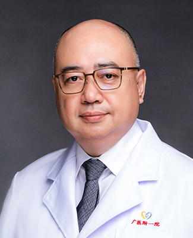

<!-- AUTO-GENERATED-BY: work/generate_obsidian_profiles.py -->

<!-- TEMPLATE: D:\workspace\信息收集整理\医生画像仓库\模板\医生画像模板.md -->

# 黎毅敏

## 基础信息

| 字段 | 内容 |
|---|---|
| 姓名 | 黎毅敏 |
| 医院 | 广州医科大学附属第一医院 |
| 科室 | 呼吸与危重症医学科、重症医学科 |
| 职称/身份 | 重症监护医学中心主任，教授 主任医师 博士研究生导师 |
| 来源链接 | [官网原文](https://www.gyfyyy.cn/cn/ks/nk/hxnk/doctor_5.html) |
| 采集日期 | 2026-08-13 |

## 简介/擅长

呼吸内科及重症医学。

## 可包装亮点

- 中华医学会重症医学分会常务委员、中华医学会呼吸病学分会重症学组副组长、广东省医学会重症医学分会主任委员、广东省危重病专家委员会副主任、中国医师协会重症医学分会及呼吸病学分会常务委员。
- 曾获国家教委科技进步奖二等奖一项，广东省科技进步奖特等奖一项，广东省科技进步奖一等奖一项，广东省科技进步奖二等奖一项，广州市科技进步奖一等奖两项，广州市科技进步三等奖一项。

## 重点疾病/人群标签

- 慢性病：
- 肿瘤：
- 生殖疾病：
- 免疫/风湿：感染、危重、重症
- 术后恢复/康复：
- 疑难重症：感染、危重、重症

## 证据摘录

> 只摘录官网公开信息中的短句或关键字段，不复制大段原文。

- 官网身份字段：重症监护医学中心主任，教授 主任医师 博士研究生导师
- 官网简介/擅长：呼吸内科及重症医学。
- 官网亮眼经历线索：中华医学会重症医学分会常务委员、中华医学会呼吸病学分会重症学组副组长、广东省医学会重症医学分会主任委员、广东省危重病专家委员会副主任、中国医师协会重症医学分会及呼吸病学分会常务委员。 曾获国家教委科技进步奖二等奖一项，广东省科技进步奖特等奖一项，广东省科技进步奖一等奖一项，广东省科技进步奖二等奖一项，广州市科技进步奖一等奖两项，广州市科技进步三等奖一项。
- 来源链接：https://www.gyfyyy.cn/cn/ks/nk/hxnk/doctor_5.html

## BD 画像摘要

黎毅敏医生可作为免疫/风湿/感染、疑难重症方向的基础画像候选。后续 BD 使用应继续以官网来源和人工复核为准，不添加疗效承诺或无来源包装。

## 合规边界

- 仅使用医院官网、官方公众号、官方小程序等公开渠道。
- 不采集私人电话、私人微信、家庭住址、患者隐私或非公开排班信息。
- 不写“保证治愈”“疗效第一”“包治疑难杂症”等无法由官网证明的表述。
