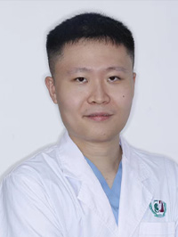

<!-- AUTO-GENERATED-BY: work/generate_obsidian_profiles.py -->

<!-- TEMPLATE: D:\workspace\信息收集整理\医生画像仓库\模板\医生画像模板.md -->

# ​叶长缨

## 基础信息

| 字段 | 内容 |
|---|---|
| 姓名 | ​叶长缨 |
| 医院 | 广州医科大学附属第三医院 |
| 科室 | 荔湾院区口腔科 |
| 职称/身份 | 医师 |
| 来源链接 | [官网原文](https://www.gy3y.cn/ks/wgk/kqk/doctor_584.html) |
| 采集日期 | 2026-08-13 |

## 简介/擅长

成人及儿童口腔综合治疗，开展活髓保存、各类阻生齿及复杂牙微创拔牙、镶牙、种植牙、显微镜下根管治疗、舒适化治疗等。

## 教育与进修经历

- 叶长缨 医师 毕业于中国医科大学，口腔临床医学临床（儿童口腔学）硕士，美国Nusmile儿童美学全瓷冠认证医师，于深圳市儿童医院、北京大学深圳医院完成口腔全科专业规范化培训，擅长成人及儿童口腔综合治疗，开展活髓保存、各类阻生齿及复杂牙微创拔牙、镶牙、种植牙、显微镜下根管治疗、舒适化治疗等。

## 可包装亮点

- 叶长缨 医师 毕业于中国医科大学，口腔临床医学临床（儿童口腔学）硕士，美国Nusmile儿童美学全瓷冠认证医师，于深圳市儿童医院、北京大学深圳医院完成口腔全科专业规范化培训，擅长成人及儿童口腔综合治疗，开展活髓保存、各类阻生齿及复杂牙微创拔牙、镶牙、种植牙、显微镜下根管治疗、舒适化治疗等。

## 重点疾病/人群标签

- 慢性病：
- 肿瘤：
- 生殖疾病：
- 免疫/风湿：
- 术后恢复/康复：
- 疑难重症：

## 证据摘录

> 只摘录官网公开信息中的短句或关键字段，不复制大段原文。

- 官网身份字段：医师
- 官网简介/擅长：成人及儿童口腔综合治疗，开展活髓保存、各类阻生齿及复杂牙微创拔牙、镶牙、种植牙、显微镜下根管治疗、舒适化治疗等。
- 官网亮眼经历线索：叶长缨 医师 毕业于中国医科大学，口腔临床医学临床（儿童口腔学）硕士，美国Nusmile儿童美学全瓷冠认证医师，于深圳市儿童医院、北京大学深圳医院完成口腔全科专业规范化培训，擅长成人及儿童口腔综合治疗，开展活髓保存、各类阻生齿及复杂牙微创拔牙、镶牙、种植牙、显微镜下根管治疗、舒适化治疗等。
- 异常提示：非医生页面或姓名异常
- 来源链接：https://www.gy3y.cn/ks/wgk/kqk/doctor_584.html

## BD 画像摘要

​叶长缨医生可作为广州医科大学附属第三医院荔湾院区口腔科的基础医生资料入库。当前重点方向以总底表标签为准，官网未展示的信息保持空白。

## 合规边界

- 仅使用医院官网、官方公众号、官方小程序等公开渠道。
- 不采集私人电话、私人微信、家庭住址、患者隐私或非公开排班信息。
- 不写“保证治愈”“疗效第一”“包治疑难杂症”等无法由官网证明的表述。
